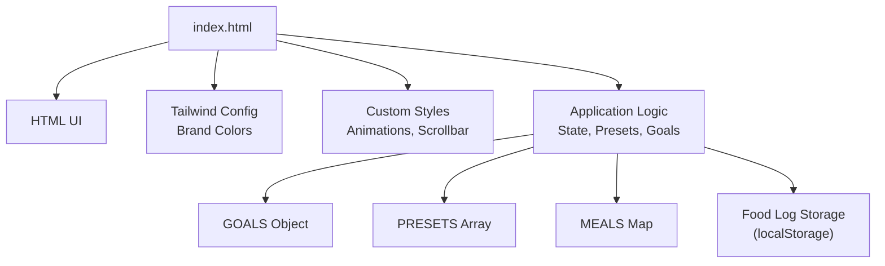
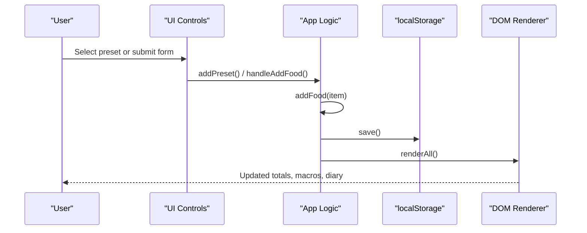

# Configuration & Customization

<cite>
**Referenced Files in This Document**
- [index.html](file://index.html)
</cite>

## Table of Contents
1. [Introduction](#introduction)
2. [Project Structure](#project-structure)
3. [Core Components](#core-components)
4. [Architecture Overview](#architecture-overview)
5. [Detailed Component Analysis](#detailed-component-analysis)
6. [Dependency Analysis](#dependency-analysis)
7. [Performance Considerations](#performance-considerations)
8. [Troubleshooting Guide](#troubleshooting-guide)
9. [Conclusion](#conclusion)
10. [Appendices](#appendices)

## Introduction
This document explains how to configure and customize NutriTrack, a single-page nutrition tracker. It focuses on:
- Modifying nutritional goals via the GOALS object
- Adding new preset foods to the PRESETS array
- Customizing theme and styling (brand colors, fonts, overrides)
- Extending meal categories and food item structure
- Implementing additional features with best practices for code organization

The application is implemented as a single HTML file with embedded CSS and JavaScript. All configuration points are centralized at the top of the script section for easy discovery and maintenance.

## Project Structure
NutriTrack consists of one primary file that contains:
- HTML markup for the UI
- Tailwind CSS configuration and custom styles
- Application logic including state, rendering, and user interactions



**Diagram sources**
- [index.html:8-18](file://index.html#L8-L18)
- [index.html:19-40](file://index.html#L19-L40)
- [index.html:288-304](file://index.html#L288-L304)

**Section sources**
- [index.html:1-478](file://index.html#L1-L478)

## Core Components
Key configuration and customization points:
- GOALS: Daily targets for calories, protein, carbs, fats
- MEALS: Meal category labels and keys used across the UI
- PRESETS: Quick-add food items with nutritional values and emoji icons
- Tailwind brand color palette: Centralized color tokens for consistent theming
- Custom CSS: Animations, transitions, and scrollbar styling

Where to find them:
- GOALS, MEALS, PRESETS: Top of the script block
- Tailwind config: Inline script before styles
- Custom styles: <style> block near the head

**Section sources**
- [index.html:288-304](file://index.html#L288-L304)
- [index.html:8-18](file://index.html#L8-L18)
- [index.html:19-40](file://index.html#L19-L40)

## Architecture Overview
High-level flow of data and rendering:
- User adds food via presets or form
- Food item is appended to the in-memory log and persisted to localStorage
- Render functions compute totals against GOALS and update UI elements
- Theme and fonts are applied via Tailwind and custom CSS



**Diagram sources**
- [index.html:318-335](file://index.html#L318-L335)
- [index.html:338-351](file://index.html#L338-L351)
- [index.html:354-360](file://index.html#L354-L360)
- [index.html:369-371](file://index.html#L369-L371)
- [index.html:383-458](file://index.html#L383-L458)

## Detailed Component Analysis

### Modify Nutritional Goals (GOALS)
What it controls:
- Daily calorie target and macro targets (protein, carbs, fats)
- Progress ring and macro bars reflect these targets
- Remaining and overage calculations depend on GOALS

How to modify:
- Locate the GOALS object at the top of the script
- Update numeric values for calories, protein, carbs, and fats
- Save and reload; the dashboard will recalculate automatically

Best practices:
- Keep units consistent (kcal for calories, grams for macros)
- Ensure realistic ratios aligned with your health objectives
- If you extend macros later, ensure all references use the same field names

Common pitfalls:
- Forgetting to update related display strings if you change units
- Leaving zero or negative values which can break progress calculations

**Section sources**
- [index.html:290](file://index.html#L290)
- [index.html:383-426](file://index.html#L383-L426)

### Add New Preset Foods (PRESETS)
What it controls:
- Quick-add buttons shown under “Quick Add”
- Each preset includes name, calories, protein, carbs, fats, and an emoji icon

How to add:
- Find the PRESETS array near the top of the script
- Append a new object with fields: name, cal, p, c, f, emoji
- The UI renders buttons dynamically from this array

Structure guidance:
- name: Display name for the preset
- cal: Calories in kcal
- p: Protein in grams
- c: Carbs in grams
- f: Fats in grams
- emoji: Emoji character for visual identification

Validation tips:
- Use non-negative numbers for cal, p, c, f
- Keep names concise for button readability
- Choose clear emojis to differentiate items

Example pattern reference:
- See existing entries for consistent formatting

**Section sources**
- [index.html:293-302](file://index.html#L293-L302)
- [index.html:318-328](file://index.html#L318-L328)
- [index.html:330-335](file://index.html#L330-L335)

### Customize Theme and Styling
Brand colors:
- Tailwind brand palette is defined inline
- Change hex codes to rebrand the app’s primary color scheme

Fonts:
- Google Fonts import sets the default font family
- Adjust weights or swap families by editing the import URL and body font-family rule

Styling overrides:
- Custom CSS defines animations, transitions, and scrollbar appearance
- You can adjust transition timings, animation keyframes, and scrollbar dimensions

Guidance:
- Keep brand colors within a cohesive scale (light to dark shades)
- Maintain contrast for accessibility when changing text and background colors
- Prefer extending Tailwind tokens rather than hardcoding colors throughout the markup

**Section sources**
- [index.html:8-18](file://index.html#L8-L18)
- [index.html:19-40](file://index.html#L19-L40)

### Extend Meal Categories
Current meals:
- breakfast, lunch, dinner, snack
- Labels are mapped in the MEALS object and used in selects and headers

How to extend:
- Add a new key-value pair to the MEALS map for the new category label
- Add a corresponding option in the meal select dropdowns
- Add a new meal card container and list element in the diary section
- Update the render loop to include the new meal key

Important considerations:
- Ensure IDs and selectors match the new meal key consistently
- Update any filtering or aggregation logic to include the new meal
- Test preset quick-add targeting the new meal

**Section sources**
- [index.html:291](file://index.html#L291)
- [index.html:165-171](file://index.html#L165-L171)
- [index.html:221-274](file://index.html#L221-L274)
- [index.html:429-457](file://index.html#L429-L457)

### Modify Food Item Structure
Current fields:
- name, cal, protein, carbs, fats, meal, id, time

How to extend:
- Add new fields where needed (e.g., fiber, sugar, serving size)
- Update the form inputs to capture new fields
- Update the render function to display new fields in the diary
- Ensure presets and manual entry both populate the new fields

Data persistence:
- Existing logs will not contain new fields; consider migration logic if necessary
- When reading old entries, provide defaults for new fields to avoid undefined behavior

**Section sources**
- [index.html:354-360](file://index.html#L354-L360)
- [index.html:338-351](file://index.html#L338-L351)
- [index.html:438-456](file://index.html#L438-L456)

### Implement Additional Features
Examples:
- Export/import daily logs
- Search/filter presets
- Weekly summary view
- Dark mode toggle

Approach:
- Keep feature-specific logic in clearly named functions
- Avoid mutating global state unexpectedly; pass parameters explicitly
- Reuse renderAll or create targeted update functions for performance
- Persist new settings in localStorage with distinct keys

**Section sources**
- [index.html:369-371](file://index.html#L369-L371)
- [index.html:383-458](file://index.html#L383-L458)

## Dependency Analysis
Internal relationships:
- GOALS drives progress calculations and UI thresholds
- PRESETS feeds the quick-add UI and creates food items
- MEALS maps keys to human-readable labels
- localStorage persists the food log across sessions
- Tailwind config and custom CSS control visual presentation

```mermaid
graph LR
GOALS["GOALS Object"] --> CALC["Totals & Percentages"]
PRESETS["PRESETS Array"] --> QUICKADD["Quick-Add Buttons"]
MEALS["MEALS Map"] --> UI_LABELS["Meal Labels"]
FOODLOG["foodLog"] --> RENDER["renderAll()"]
RENDER --> UI["Dashboard & Diary"]
STORAGE["localStorage"] <- --> FOODLOG
```

**Diagram sources**
- [index.html:290-304](file://index.html#L290-L304)
- [index.html:383-458](file://index.html#L383-L458)
- [index.html:369-371](file://index.html#L369-L371)

**Section sources**
- [index.html:288-304](file://index.html#L288-L304)
- [index.html:383-458](file://index.html#L383-L458)

## Performance Considerations
- Rendering updates occur after each add/delete/reset; keep lists small for responsiveness
- Avoid heavy computations inside render loops; precompute totals once per render
- Minimize DOM churn by updating only changed sections when scaling up
- Use efficient string concatenation or template literals for list rendering

[No sources needed since this section provides general guidance]

## Troubleshooting Guide
Common issues and resolutions:
- Totals not updating:
  - Verify that addFood calls save and renderAll
  - Check that GOALS values are valid numbers
- Preset buttons not appearing:
  - Confirm PRESETS array is populated and renderPresets runs during init
- Brand colors not applying:
  - Ensure Tailwind config is loaded before styles and that class names use the correct token names
- Font not loading:
  - Validate Google Fonts import URL and network access
- Data loss after reset:
  - Confirm resetAll clears localStorage and re-renders

Operational references:
- Initialization and event binding
- Preset rendering and addition
- Form handling and validation
- Core add/delete/save/reset flows
- Full render pipeline

**Section sources**
- [index.html:307-315](file://index.html#L307-L315)
- [index.html:318-335](file://index.html#L318-L335)
- [index.html:338-351](file://index.html#L338-L351)
- [index.html:354-380](file://index.html#L354-L380)
- [index.html:383-458](file://index.html#L383-L458)

## Conclusion
NutriTrack centralizes configuration in a single file for simplicity. To customize:
- Edit GOALS for targets
- Expand PRESETS for quick-add options
- Adjust Tailwind brand colors and custom CSS for theming
- Extend MEALS and the diary layout for new categories
- Introduce new fields carefully and update forms and rendering accordingly

Following the patterns and best practices outlined here will help maintain clarity and stability as you evolve the application.

[No sources needed since this section summarizes without analyzing specific files]

## Appendices

### Quick Reference: Where to Edit
- GOALS: Script start
- PRESETS: Script start
- MEALS: Script start
- Tailwind brand colors: Inline script in head
- Custom styles: Style block in head
- UI templates: Body HTML sections
- Core logic: Functions below the state declarations

**Section sources**
- [index.html:8-18](file://index.html#L8-L18)
- [index.html:19-40](file://index.html#L19-L40)
- [index.html:288-304](file://index.html#L288-L304)
- [index.html:383-458](file://index.html#L383-L458)