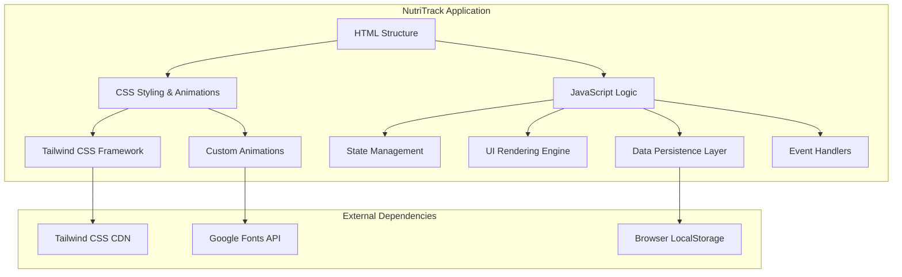
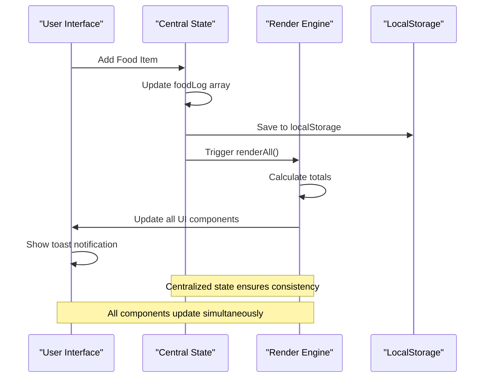
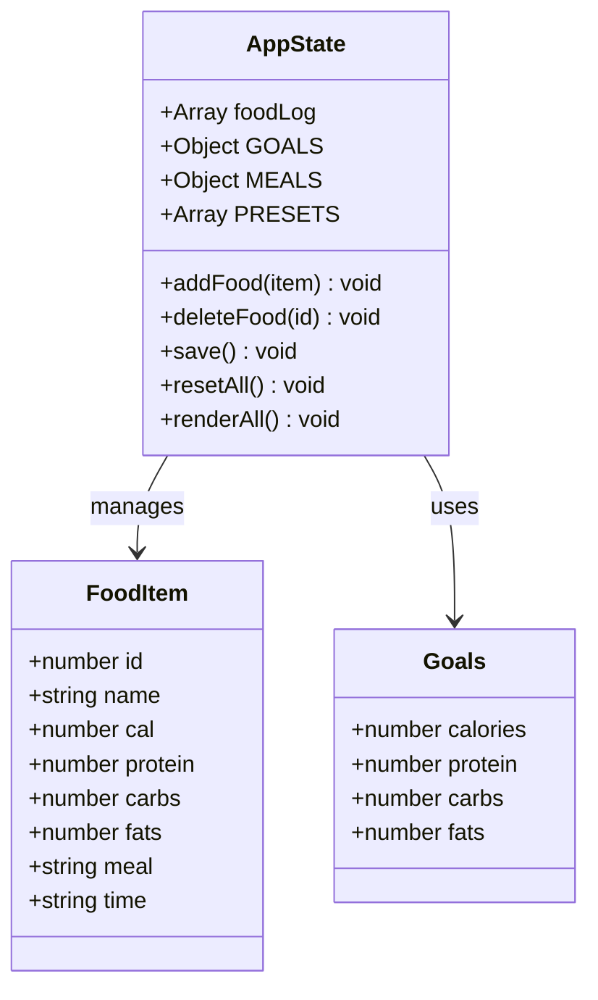
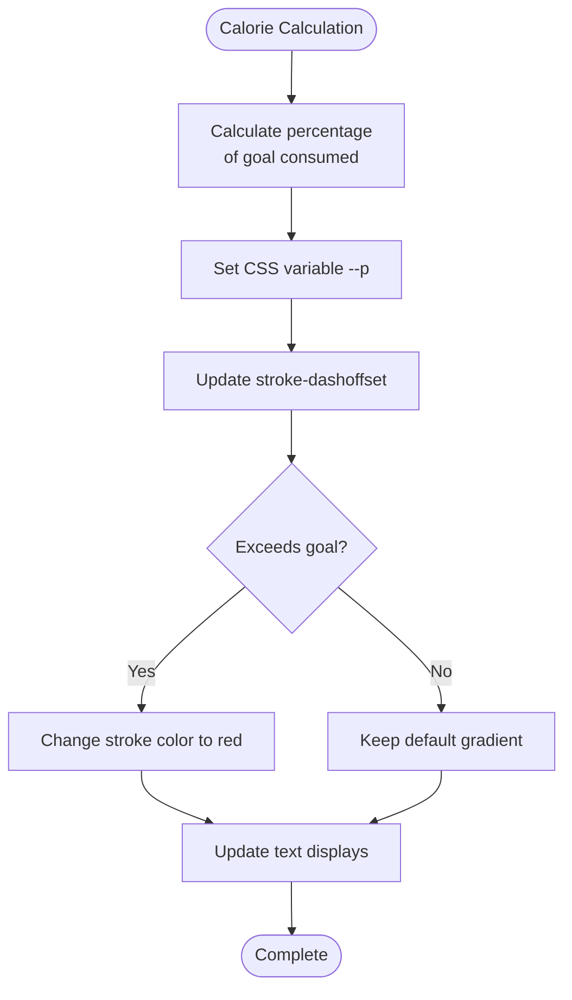
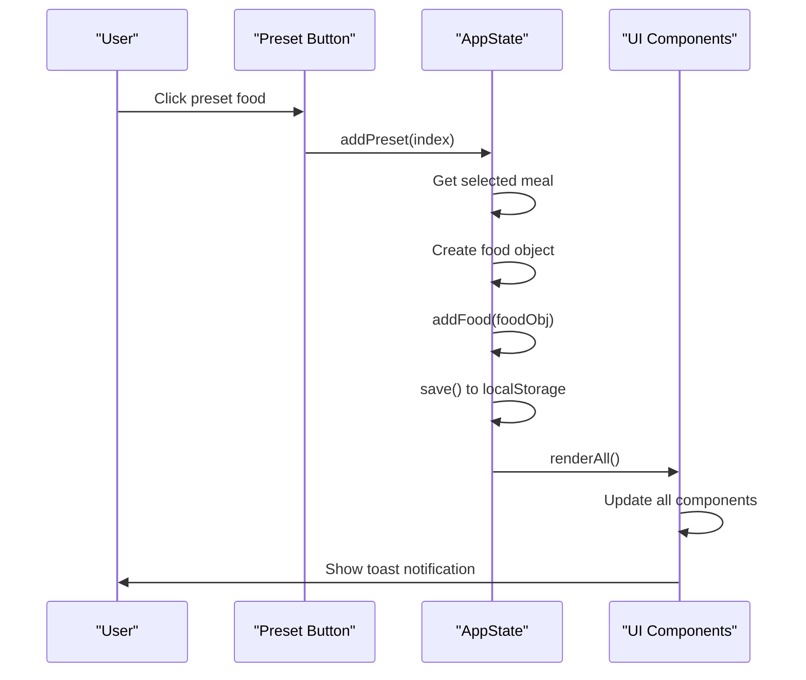
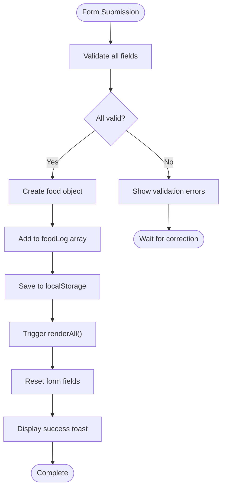
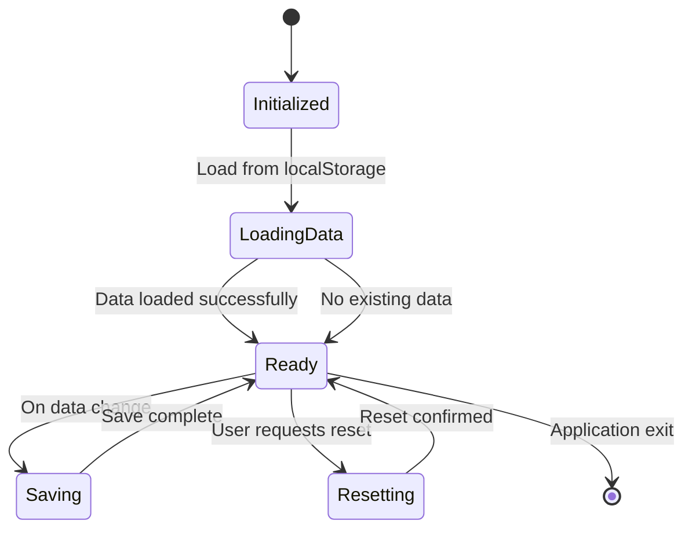
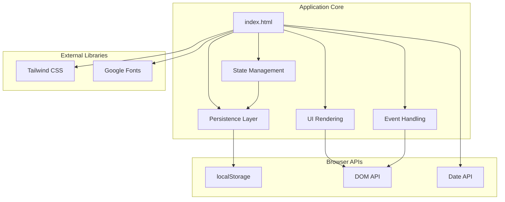

# Core Features

<cite>
**Referenced Files in This Document**
- [index.html](file://index.html)
</cite>

## Table of Contents
1. [Introduction](#introduction)
2. [Project Structure](#project-structure)
3. [Core Components](#core-components)
4. [Architecture Overview](#architecture-overview)
5. [Detailed Component Analysis](#detailed-component-analysis)
6. [Dependency Analysis](#dependency-analysis)
7. [Performance Considerations](#performance-considerations)
8. [Troubleshooting Guide](#troubleshooting-guide)
9. [Conclusion](#conclusion)

## Introduction

NutriTrack is a comprehensive single-page web application designed to help users track their daily nutritional intake with an intuitive and visually appealing interface. The application provides real-time calorie tracking, macronutrient monitoring, quick food presets, manual entry forms, organized meal categorization, and automatic data persistence. Built with modern web technologies including Tailwind CSS for styling and vanilla JavaScript for functionality, NutriTrack offers a seamless nutrition tracking experience focused on Thai cuisine and dietary preferences.

The application's primary goal is to simplify daily nutrition tracking by providing multiple input methods, visual feedback mechanisms, and automatic synchronization across all interface components through a centralized state management system.

## Project Structure

NutriTrack follows a single-file architecture pattern, consolidating HTML structure, CSS styling, and JavaScript logic within one comprehensive file. This approach ensures simplicity and ease of deployment while maintaining clear separation of concerns through well-organized code sections.

**Diagram sources**
- [index.html:1-478](file://index.html#L1-L478)

**Section sources**
- [index.html:1-478](file://index.html#L1-L478)

## Core Components

### Interactive Dashboard with SVG Calorie Ring Visualization

The dashboard serves as the central hub for nutritional information display, featuring an animated SVG-based calorie ring that provides immediate visual feedback on daily progress. The ring dynamically adjusts its stroke-dashoffset property based on consumed calories versus goals, with smooth CSS transitions creating an engaging user experience.

Key features include:
- Real-time percentage calculation and visual representation
- Color-coded status indicators (green for under goal, red for over goal)
- Animated progress transitions with 0.6s ease timing
- Responsive design adapting to different screen sizes
- Gradient color scheme using brand colors for visual consistency

### Real-time Macronutrient Tracking with Progress Bars

The macronutrient tracking system provides detailed breakdown of protein, carbohydrates, and fat intake through animated progress bars. Each macro category includes:
- Individual progress bars with distinct color schemes
- Percentage completion badges showing current progress
- Numerical values displaying grams consumed vs. target
- Smooth width transitions with 0.5s ease animations
- Status indicators with contextual color coding

### Quick Preset Food Addition System

The preset system offers rapid food logging through 8 pre-configured Thai food options, each containing complete nutritional information. The system includes:
- Visual food cards with emoji icons and nutritional summaries
- Meal selection dropdown for automatic categorization
- One-click addition with toast notifications
- Predefined nutritional values optimized for Thai cuisine
- Hover and active state animations for enhanced interactivity

### Manual Food Entry Form with Validation

The comprehensive form system allows users to add custom foods with built-in validation:
- Required field validation for name, calories, and macros
- Numeric input constraints with minimum values
- Real-time focus states with brand-colored borders
- Automatic form reset after successful submission
- Responsive grid layout adapting to screen sizes

### Organized Food Diary with Meal Categorization

The diary section organizes logged foods into four meal categories:
- Breakfast, Lunch, Dinner, and Snack sections
- Per-meal calorie totals with color-coded headers
- Individual food items with nutritional breakdowns
- Hover-to-reveal delete functionality
- Empty state messaging for unpopulated meals
- Time-stamped entries with automatic formatting

### Automatic Data Persistence

The application implements robust data persistence using browser localStorage:
- Automatic saving on every data modification
- JSON serialization for complex food objects
- Error handling for storage operations
- Data restoration on application initialization
- Reset functionality with confirmation prompts

**Section sources**
- [index.html:65-157](file://index.html#L65-L157)
- [index.html:159-173](file://index.html#L159-L173)
- [index.html:175-214](file://index.html#L175-L214)
- [index.html:216-275](file://index.html#L216-L275)
- [index.html:288-478](file://index.html#L288-L478)

## Architecture Overview

NutriTrack employs a reactive state management pattern where all UI components automatically update when underlying data changes. The architecture follows a unidirectional data flow pattern with centralized state management.

**Diagram sources**
- [index.html:354-360](file://index.html#L354-L360)
- [index.html:383-458](file://index.html#L383-L458)

The application maintains a single source of truth through the `foodLog` array, which gets updated whenever users add or remove food items. The `renderAll()` function acts as the central rendering engine, recalculating all nutritional totals and updating every UI component simultaneously.

**Section sources**
- [index.html:288-478](file://index.html#L288-L478)

## Detailed Component Analysis

### State Management System

The state management system centers around the `foodLog` array, which serves as the single source of truth for all nutritional data. This approach ensures data consistency across all UI components and eliminates the need for complex event broadcasting systems.

**Diagram sources**
- [index.html:290-304](file://index.html#L290-L304)
- [index.html:354-360](file://index.html#L354-L360)

**Section sources**
- [index.html:288-380](file://index.html#L288-L380)

### SVG Calorie Ring Implementation

The calorie ring visualization uses CSS custom properties and SVG stroke-dasharray manipulation to create smooth animated progress indicators. The implementation leverages CSS variables for dynamic updates and CSS transitions for smooth animations.

**Diagram sources**
- [index.html:392-412](file://index.html#L392-L412)

**Section sources**
- [index.html:68-104](file://index.html#L68-L104)
- [index.html:392-412](file://index.html#L392-L412)

### Preset Food System Architecture

The preset system provides quick access to common Thai foods with complete nutritional information. Each preset includes predefined values for calories, protein, carbohydrates, and fats, optimized for typical Thai cuisine portions.

**Diagram sources**
- [index.html:330-335](file://index.html#L330-L335)
- [index.html:354-360](file://index.html#L354-L360)

**Section sources**
- [index.html:293-302](file://index.html#L293-L302)
- [index.html:317-335](file://index.html#L317-L335)

### Form Validation and Processing

The manual food entry form implements comprehensive validation and error handling to ensure data integrity. The form processing pipeline validates inputs, creates structured food objects, and triggers cascading updates throughout the application.

**Diagram sources**
- [index.html:338-351](file://index.html#L338-L351)

**Section sources**
- [index.html:175-214](file://index.html#L175-L214)
- [index.html:338-351](file://index.html#L338-L351)

### Data Persistence Layer

The persistence layer handles all data storage operations using browser localStorage. It provides automatic saving, loading, and reset functionality with appropriate error handling and user feedback.

**Diagram sources**
- [index.html:304](file://index.html#L304)
- [index.html:369-380](file://index.html#L369-L380)

**Section sources**
- [index.html:304](file://index.html#L304)
- [index.html:369-380](file://index.html#L369-L380)

## Dependency Analysis

The application maintains minimal external dependencies while leveraging modern web APIs for optimal performance. The dependency graph shows clear separation between UI rendering, data management, and persistence layers.

**Diagram sources**
- [index.html:7-18](file://index.html#L7-L18)
- [index.html:20-21](file://index.html#L20-L21)
- [index.html:304](file://index.html#L304)

**Section sources**
- [index.html:1-478](file://index.html#L1-L478)

## Performance Considerations

NutriTrack is optimized for performance through several key strategies:

### Efficient DOM Updates
- Batched DOM manipulations through centralized `renderAll()` function
- CSS transitions instead of JavaScript animations for smoother performance
- Event delegation for dynamic elements to minimize memory usage

### Memory Management
- Single source of truth prevents data duplication
- Efficient array operations for food log management
- Proper cleanup of event listeners and timers

### Rendering Optimization
- CSS custom properties for dynamic styling without reflows
- Conditional rendering based on data presence
- Debounced toast notifications to prevent excessive DOM updates

## Troubleshooting Guide

### Common Issues and Solutions

**Data Not Persisting**
- Verify browser localStorage is enabled
- Check for storage quota limits
- Ensure proper JSON serialization of food objects

**UI Not Updating**
- Confirm `renderAll()` is called after data modifications
- Check for JavaScript console errors
- Verify DOM element IDs match expected values

**Form Validation Errors**
- Ensure all required fields contain valid numeric values
- Check for empty string inputs being converted to numbers
- Verify meal selection dropdown has valid values

**Performance Issues**
- Monitor localStorage size growth
- Check for excessive re-rendering
- Optimize large food log arrays if needed

**Section sources**
- [index.html:369-380](file://index.html#L369-L380)
- [index.html:460-471](file://index.html#L460-L471)

## Conclusion

NutriTrack demonstrates effective single-page application architecture with clean separation of concerns and efficient state management. The application successfully combines multiple input methods, real-time visual feedback, and automatic data persistence to create a comprehensive nutrition tracking solution. The centralized state management approach ensures consistency across all UI components, while the modular design allows for easy extension and maintenance.

The application's strength lies in its simplicity and effectiveness - providing powerful nutrition tracking capabilities through a streamlined, user-friendly interface that requires no external dependencies beyond standard web technologies. The thoughtful implementation of animations, responsive design, and accessibility features makes it suitable for diverse user needs and device types.