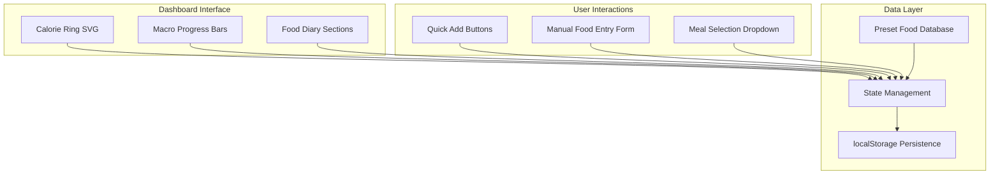
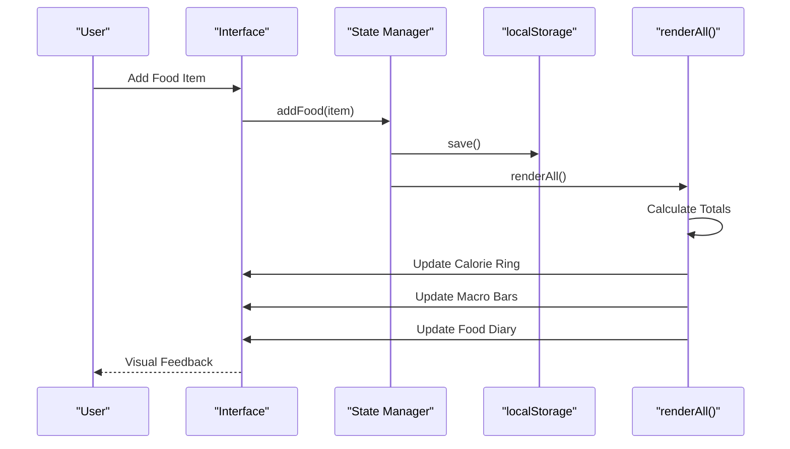
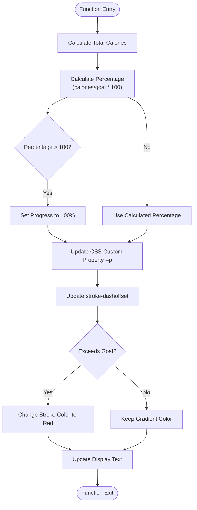
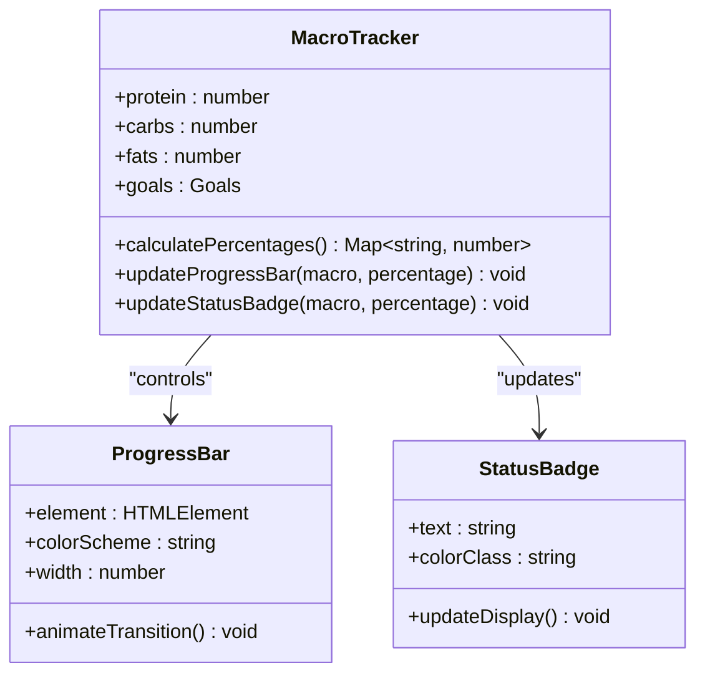

# Dashboard & Progress Tracking

<cite>
**Referenced Files in This Document**
- [index.html](file://index.html)
</cite>

## Table of Contents
1. [Introduction](#introduction)
2. [Project Structure](#project-structure)
3. [Core Components](#core-components)
4. [Architecture Overview](#architecture-overview)
5. [Detailed Component Analysis](#detailed-component-analysis)
6. [Dependency Analysis](#dependency-analysis)
7. [Performance Considerations](#performance-considerations)
8. [Troubleshooting Guide](#troubleshooting-guide)
9. [Conclusion](#conclusion)

## Introduction
NutriTrack provides an interactive dashboard with real-time calorie ring visualization and animated macronutrient progress bars. Users log foods to automatically update totals and visual indicators toward daily goals.

## Project Structure
The application is implemented as a single-page interface with embedded styles and scripts:
- **HTML Structure**: Semantic sections for dashboard, quick-add forms, and food diary
- **CSS Styling**: Tailwind CSS framework with custom animations and responsive design
- **JavaScript Logic**: State management, data persistence, and real-time rendering



**Diagram sources**
- [index.html:65-157](file://index.html#L65-L157)
- [index.html:288-475](file://index.html#L288-L475)

**Section sources**
- [index.html:1-478](file://index.html#L1-L478)

## Core Components

### Calorie Ring Visualization
The interactive SVG-based calorie ring provides real-time progress tracking toward daily calorie goals with gradient stroke animation and color changes when exceeding targets.

### Macronutrient Progress System
Animated progress bars display protein, carbohydrates, and fats intake versus goals with percentage indicators and status badges.

### Real-time Calculation Engine
Automatic calculation system that aggregates all logged foods and updates visual elements instantly.

**Section sources**
- [index.html:68-104](file://index.html#L68-L104)
- [index.html:106-156](file://index.html#L106-L156)
- [index.html:382-458](file://index.html#L382-L458)

## Architecture Overview



**Diagram sources**
- [index.html:354-360](file://index.html#L354-L360)
- [index.html:382-458](file://index.html#L382-L458)

## Detailed Component Analysis

### Calorie Ring Implementation

#### SVG Circle Calculations
The calorie ring uses precise SVG circle calculations with CSS custom properties for dynamic progress updates:



**Diagram sources**
- [index.html:392-412](file://index.html#L392-L412)

#### Technical Implementation Details
- **CSS Custom Properties**: Uses `--p` variable for smooth transitions
- **Stroke Animation**: Implements `stroke-dasharray` and `stroke-dashoffset` for circular progress
- **Gradient Support**: Linear gradient from green (#34d399) to darker green (#059669)
- **Overflow Handling**: Automatic color change to red (#f87171) when exceeding goals
- **Responsive Design**: Scales properly across different screen sizes

**Section sources**
- [index.html:22-27](file://index.html#L22-L27)
- [index.html:72-81](file://index.html#L72-L81)
- [index.html:392-412](file://index.html#L392-L412)

### Macronutrient Progress System

#### Animated Progress Bars
Each macronutrient (protein, carbohydrates, fats) has dedicated progress bars with unique color schemes:



**Diagram sources**
- [index.html:110-148](file://index.html#L110-L148)
- [index.html:413-426](file://index.html#L413-L426)

#### Color Coding System
- **Protein**: Blue gradient (#3b82f6 to #2563eb) with 🥩 emoji
- **Carbohydrates**: Amber gradient (#f59e0b to #d97706) with 🍚 emoji  
- **Fats**: Pink gradient (#ec4899 to #db2777) with 🧈 emoji

**Section sources**
- [index.html:110-148](file://index.html#L110-L148)
- [index.html:413-426](file://index.html#L413-L426)

### Real-time Calculation Engine

#### Data Aggregation Process
The system automatically calculates totals from all logged foods using efficient array reduction:

```mermaid
flowchart LR
A[foodLog Array] --> B[reduce() Function]
B --> C{For Each Food Item}
C --> D[Accumulate Calories]
C --> E[Accumulate Protein]
C --> F[Accumulate Carbs]
C --> G[Accumulate Fats]
D --> H[Totals Object]
E --> H
F --> H
G --> H
H --> I[Update Dashboard]
```

**Diagram sources**
- [index.html:384-390](file://index.html#L384-L390)

#### Performance Optimizations
- **Efficient Reduction**: Single-pass calculation through food array
- **DOM Caching**: Reuses element references where possible
- **Conditional Updates**: Only updates changed values
- **Debounced Rendering**: Prevents excessive DOM manipulation

**Section sources**
- [index.html:382-458](file://index.html#L382-L458)

### Responsive Design Patterns

#### Mobile-First Approach
- **Flexible Grid Layout**: CSS Grid with responsive breakpoints
- **Touch-Friendly Controls**: Adequate spacing for mobile interactions
- **Adaptive Typography**: Scalable font sizes across devices
- **Viewport Optimization**: Proper viewport meta tag configuration

#### Accessibility Features
- **Semantic HTML**: Proper heading hierarchy and section organization
- **ARIA Labels**: Implicit accessibility through semantic markup
- **Keyboard Navigation**: Full keyboard support for form inputs
- **Screen Reader Friendly**: Descriptive text content and labels

**Section sources**
- [index.html:66](file://index.html#L66)
- [index.html:178-213](file://index.html#L178-L213)

## Dependency Analysis

```mermaid
graph TD
subgraph "Core Dependencies"
A[index.html] --> B[Tailwind CSS CDN]
A --> C[Google Fonts API]
A --> D[localStorage API]
end
subgraph "Internal Dependencies"
E[renderAll()] --> F[addFood()]
E --> G[deleteFood()]
E --> H[save()]
F --> E
G --> E
H --> E
end
subgraph "UI Components"
I[Calorie Ring] --> E
J[Macro Bars] --> E
K[Food Diary] --> E
L[Preset Buttons] --> F
M[Food Form] --> F
end
```

**Diagram sources**
- [index.html:7-18](file://index.html#L7-L18)
- [index.html:288-475](file://index.html#L288-L475)

**Section sources**
- [index.html:7-18](file://index.html#L7-L18)
- [index.html:288-475](file://index.html#L288-L475)

## Performance Considerations

### Rendering Optimization
- **Batch Updates**: All dashboard updates occur in single renderAll() function call
- **CSS Transitions**: Hardware-accelerated animations for smooth progress updates
- **Memory Management**: Efficient array operations and minimal DOM manipulation
- **Event Delegation**: Single event listeners for multiple preset buttons

### Data Persistence Strategy
- **Local Storage**: Client-side data persistence without server dependencies
- **JSON Serialization**: Compact data format for efficient storage
- **Automatic Backup**: Real-time synchronization between state and storage

## Troubleshooting Guide

### Common Issues and Solutions

#### SVG Ring Not Updating
- **Check CSS Custom Properties**: Ensure `--p` variable is properly set
- **Verify SVG Elements**: Confirm progress circle exists and has correct attributes
- **Debug Console**: Check for JavaScript errors in browser developer tools

#### Progress Bars Stuck at 0%
- **Validate Input Data**: Ensure food items have valid numeric values
- **Check Goal Configuration**: Verify GOALS object contains proper values
- **Inspect DOM Elements**: Confirm macro bar elements exist in DOM

#### Data Not Persisting
- **Browser Storage**: Check if localStorage is enabled in browser settings
- **Storage Quota**: Verify sufficient storage space available
- **Cross-Origin Restrictions**: Ensure no security policies blocking storage access

**Section sources**
- [index.html:382-458](file://index.html#L382-L458)
- [index.html:369-371](file://index.html#L369-L371)

## Conclusion

NutriTrack's dashboard implements a sophisticated real-time progress tracking system with intuitive visual feedback. The combination of SVG animations, CSS custom properties, and efficient JavaScript algorithms creates a responsive user experience that accurately reflects nutritional intake against daily goals. The modular architecture ensures maintainability while providing comprehensive accessibility and responsive design features suitable for diverse device usage patterns.