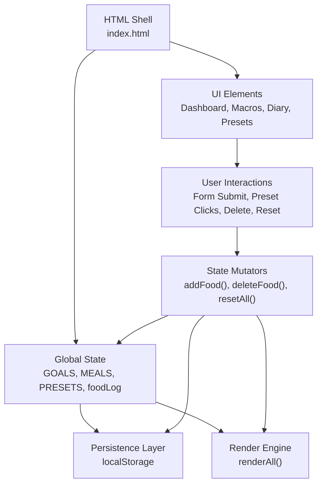
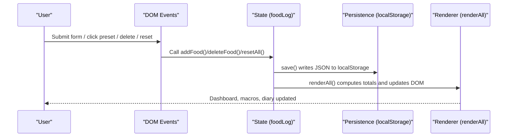
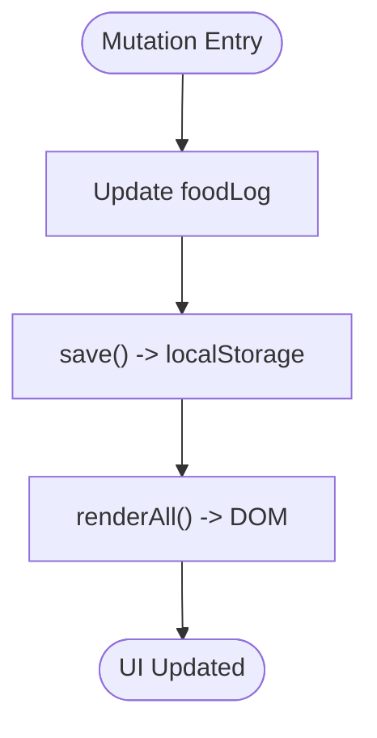
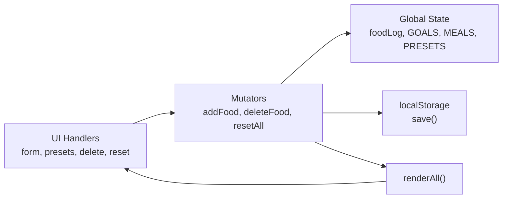

# Data Persistence & State Management

<cite>
**Referenced Files in This Document**
- [index.html](file://index.html)
</cite>

## Table of Contents
1. [Introduction](#introduction)
2. [Project Structure](#project-structure)
3. [Core Components](#core-components)
4. [Architecture Overview](#architecture-overview)
5. [Detailed Component Analysis](#detailed-component-analysis)
6. [Dependency Analysis](#dependency-analysis)
7. [Performance Considerations](#performance-considerations)
8. [Troubleshooting Guide](#troubleshooting-guide)
9. [Conclusion](#conclusion)

## Introduction
NutriTrack is a single-page nutrition tracker that persists user food logs across browser sessions using localStorage. It uses a centralized, global-state approach with simple observer-like updates: when state changes, the UI is re-rendered via a central render function. The application maintains goals, meal labels, preset foods, and the current day’s food log. On startup, it loads existing data from storage and renders the dashboard, presets, and diary.

## Project Structure
The application is implemented as a single HTML file containing embedded CSS and JavaScript. All state, persistence, rendering, and event handling logic resides within one script block.

**Diagram sources**
- [index.html:288-474](file://index.html#L288-L474)

**Section sources**
- [index.html:1-478](file://index.html#L1-L478)

## Core Components
- Centralized state variables:
  - GOALS: daily targets for calories, protein, carbs, fats.
  - MEALS: human-readable labels for meals.
  - PRESETS: quick-add food items with nutritional values.
  - foodLog: array of food entries for the current session/day.
- Initialization:
  - Loads persisted foodLog from localStorage on startup.
  - Renders presets and full dashboard.
  - Attaches form submission handler.
- Persistence:
  - save() serializes foodLog into localStorage under a fixed key.
  - On init, foodLog is deserialized from localStorage or initialized to an empty array.
- State mutations:
  - addFood(): creates a new entry with unique id and timestamp, pushes to foodLog, persists, then re-renders.
  - deleteFood(id): removes an entry by id, persists, then re-renders.
  - resetAll(): clears all data after confirmation, persists, then re-renders.
- Rendering:
  - renderAll(): aggregates totals, updates calorie ring, macro bars, per-meal lists, and status badges.

**Section sources**
- [index.html:288-315](file://index.html#L288-L315)
- [index.html:304](file://index.html#L304)
- [index.html:354-380](file://index.html#L354-L380)
- [index.html:383-458](file://index.html#L383-L458)

## Architecture Overview
The app follows a simple state-driven architecture:
- Global state holds all runtime data.
- User actions mutate state through small functions.
- Each mutation persists to localStorage and triggers a full UI refresh via renderAll().
- No fine-grained observers; renderAll() acts as a central update point.

**Diagram sources**
- [index.html:307-315](file://index.html#L307-L315)
- [index.html:354-380](file://index.html#L354-L380)
- [index.html:383-458](file://index.html#L383-L458)

## Detailed Component Analysis

### Global State and Initialization
- GOALS defines target values used to compute percentages and remaining/over amounts.
- MEALS provides display names for each meal category.
- PRESETS contains predefined foods with name, calories, and macros.
- foodLog is initialized by reading from localStorage; if absent, starts as an empty array.
- init() sets the current date, renders presets, and performs the first renderAll(). It also binds the form submit handler.

Key behaviors:
- Deserialization on load ensures continuity across sessions.
- Early renderAll() guarantees the UI reflects any previously saved data immediately.

**Section sources**
- [index.html:288-315](file://index.html#L288-L315)
- [index.html:304](file://index.html#L304)

### Data Model for Food Items
Each food item includes:
- id: unique identifier generated by combining timestamp and random component.
- time: localized time string recorded at creation.
- name: food label.
- cal: total calories.
- protein, carbs, fats: macronutrient grams.
- meal: category among breakfast, lunch, dinner, snack.

Notes:
- ID generation uses a composite of Date.now() and Math.random() to reduce collision risk.
- Timestamp is stored as a formatted time string for display purposes.

**Section sources**
- [index.html:354-360](file://index.html#L354-L360)

### Persistence Layer (localStorage)
- save(): serializes the entire foodLog array to a JSON string and stores it under a fixed key.
- Initialization reads this key and parses JSON into foodLog; defaults to an empty array if missing.

Operational characteristics:
- Synchronous read/write operations.
- Entire dataset is serialized/deserialized on each save/load.

**Section sources**
- [index.html:304](file://index.html#L304)
- [index.html:369-371](file://index.html#L369-L371)

### State Mutators and Observer Pattern
- addFood(item):
  - Assigns id and time.
  - Appends to foodLog.
  - Persists via save().
  - Triggers renderAll().
- deleteFood(id):
  - Filters out the item by id.
  - Persists via save().
  - Triggers renderAll().
- resetAll():
  - Prompts for confirmation.
  - Clears foodLog.
  - Persists via save().
  - Triggers renderAll().

This pattern mirrors an observer where renderAll() is invoked after every state change to keep the UI consistent.

**Diagram sources**
- [index.html:354-380](file://index.html#L354-L380)
- [index.html:383-458](file://index.html#L383-L458)

**Section sources**
- [index.html:354-380](file://index.html#L354-L380)

### Rendering and UI Updates
renderAll() performs:
- Aggregation of totals for calories and macros across all items.
- Computation of percentage progress toward goals.
- Updating the SVG ring and macro bars based on computed values.
- Populating per-meal sections with filtered items and per-meal totals.
- Setting status badges with rounded percentages.

Data flow:
- Reads from global foodLog.
- Computes derived metrics.
- Writes to specific DOM nodes by id/class selectors.

**Section sources**
- [index.html:383-458](file://index.html#L383-L458)

### Form Handling and Validation
- handleAddFood(e):
  - Prevents default form submission.
  - Reads and trims inputs; coerces numeric fields to floats with fallbacks.
  - Validates presence of name before adding.
  - Calls addFood() with normalized values.
  - Resets the form and shows a toast notification.

Validation behavior:
- Non-empty name required.
- Numeric fields default to 0 if invalid or empty.

**Section sources**
- [index.html:338-351](file://index.html#L338-L351)

### Preset Quick-Add Flow
- renderPresets():
  - Builds buttons for each preset with emoji, name, calories, and macros.
- addPreset(index):
  - Resolves selected meal from dropdown.
  - Calls addFood() with preset data mapped to the model.
  - Shows a toast confirming addition.

**Section sources**
- [index.html:318-335](file://index.html#L318-L335)

### Reset Functionality
- resetAll():
  - Uses a confirmation dialog before clearing.
  - Clears foodLog, persists, and re-renders.
  - Displays a toast upon completion.

**Section sources**
- [index.html:373-380](file://index.html#L373-L380)

## Dependency Analysis
High-level dependencies:
- UI depends on global state (foodLog, GOALS, MEALS, PRESETS).
- State mutators depend on persistence (localStorage) and renderer (renderAll()).
- Renderer depends only on global state.

**Diagram sources**
- [index.html:307-315](file://index.html#L307-L315)
- [index.html:354-380](file://index.html#L354-L380)
- [index.html:383-458](file://index.html#L383-L458)

**Section sources**
- [index.html:288-474](file://index.html#L288-L474)

## Performance Considerations
- Frequent localStorage writes:
  - Each mutation calls save(), which serializes the entire foodLog. For large logs, this can become costly.
  - Mitigations:
    - Debounce saves during rapid successive additions.
    - Batch updates by accumulating changes and saving once per tick.
    - Consider chunking or versioned migration strategies if data grows significantly.
- Full re-render on every change:
  - renderAll() recomputes totals and rebuilds list HTML each time.
  - Mitigations:
    - Incremental DOM updates for added/deleted items.
    - Virtualization or pagination if the list becomes large.
- ID uniqueness:
  - Composite of timestamp and random reduces collisions but does not guarantee absolute uniqueness.
  - Consider a dedicated UUID generator if strict uniqueness is required.

[No sources needed since this section provides general guidance]

## Troubleshooting Guide
Common issues and remedies:
- localStorage unavailable or quota exceeded:
  - Symptom: save() fails silently or throws depending on environment.
  - Remedies:
    - Wrap save() in try/catch and degrade gracefully (e.g., show a warning toast).
    - Implement fallback to in-memory-only mode if storage is unavailable.
- Corrupted or malformed stored data:
  - Symptom: parse error during initialization.
  - Remedies:
    - Wrap JSON.parse in try/catch and reset to an empty array on failure.
    - Add a migration helper to normalize older formats if schema evolves.
- Duplicate IDs:
  - Symptom: deleteFood may remove wrong item if IDs collide.
  - Remedies:
    - Use a robust ID generator (e.g., crypto.randomUUID if available).
    - Validate uniqueness before persisting.
- Stale UI after errors:
  - Ensure renderAll() is called even when partial failures occur, so UI remains consistent.

**Section sources**
- [index.html:369-371](file://index.html#L369-L371)
- [index.html:304](file://index.html#L304)
- [index.html:354-360](file://index.html#L354-L360)

## Conclusion
NutriTrack employs a straightforward, effective approach to data persistence and state management:
- Centralized global state with clear responsibilities.
- Simple observer-like updates via renderAll() after each mutation.
- Robust enough for typical usage patterns, with room for performance improvements such as debounced saves and incremental rendering.
- Clear paths for future enhancements like schema migrations, better ID generation, and resilient storage handling.