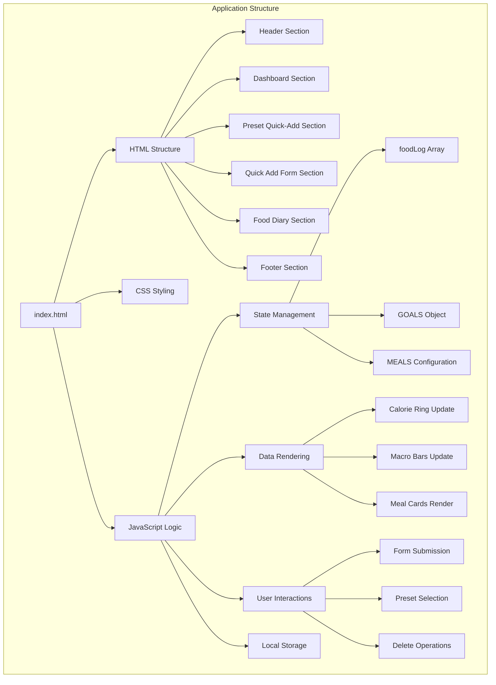
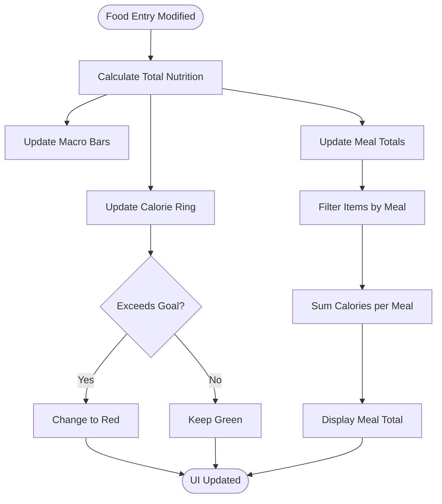
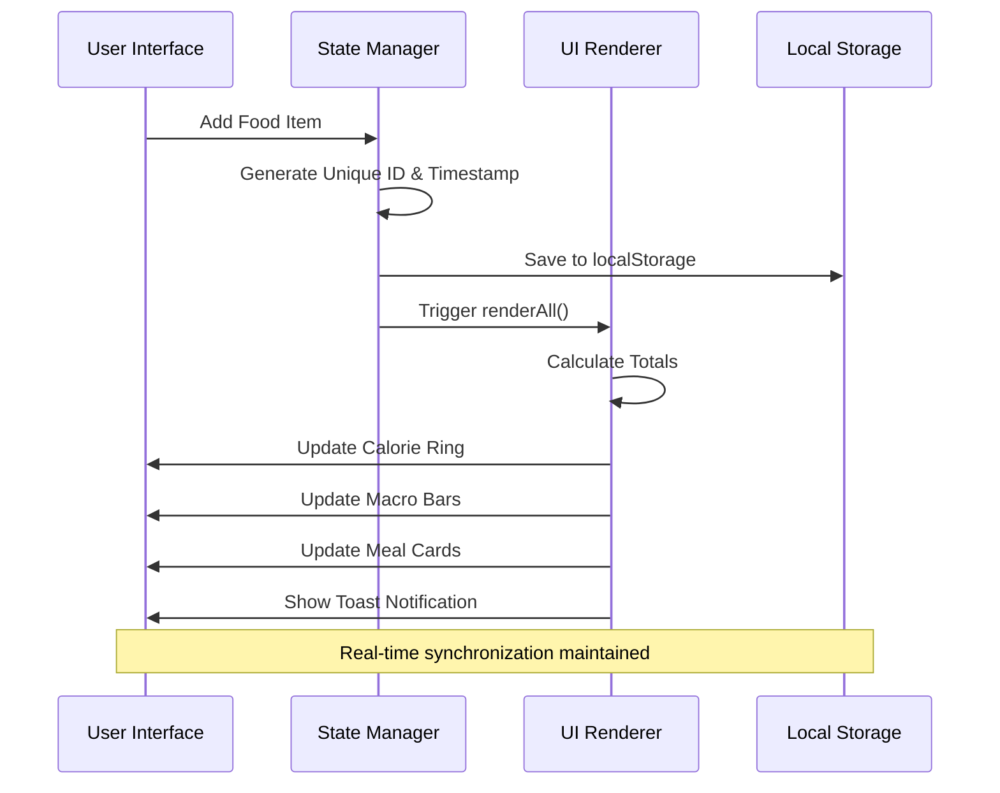
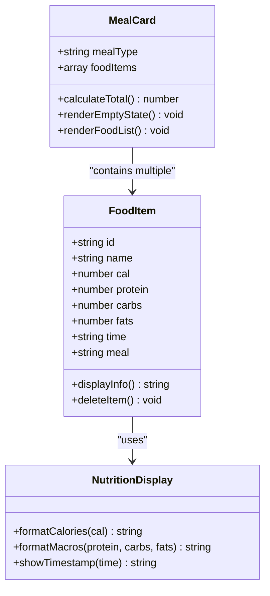
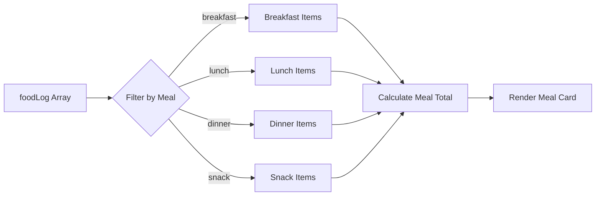
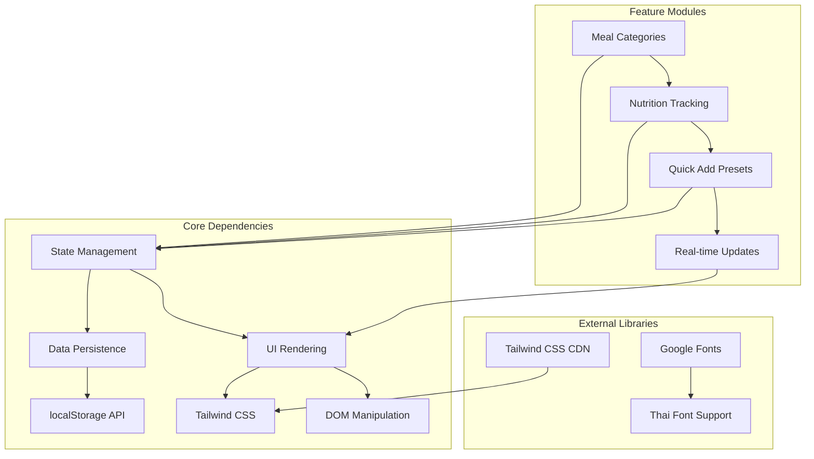

# Food Diary Management

<cite>
**Referenced Files in This Document**
- [index.html](file://index.html)
</cite>

## Table of Contents
1. [Introduction](#introduction)
2. [Project Structure](#project-structure)
3. [Core Components](#core-components)
4. [Architecture Overview](#architecture-overview)
5. [Detailed Component Analysis](#detailed-component-analysis)
6. [Dependency Analysis](#dependency-analysis)
7. [Performance Considerations](#performance-considerations)
8. [Troubleshooting Guide](#troubleshooting-guide)
9. [Conclusion](#conclusion)

## Introduction

NutriTrack is a comprehensive food diary management system designed to help users track their daily nutritional intake with an intuitive, visually appealing interface. The application provides real-time tracking of calories and macronutrients (protein, carbohydrates, fats) across four distinct meal categories: breakfast (มื้อเช้า), lunch (มื้อกลางวัน), dinner (มื้อเย็น), and snacks (ของว่าง).

The system features automatic meal total calculations that update in real-time as foods are added or removed, hover-reveal delete functionality for individual items, smooth animations for user interactions, and responsive design that adapts to different screen sizes. All data is persisted using localStorage, ensuring user progress is maintained across sessions.

## Project Structure

The NutriTrack application is implemented as a single-page web application contained within one HTML file. The architecture follows a modular JavaScript pattern with clear separation between state management, rendering logic, and user interaction handlers.

**Diagram sources**
- [index.html:1-478](file://index.html#L1-L478)

**Section sources**
- [index.html:1-478](file://index.html#L1-L478)

## Core Components

### State Management System

The application maintains its state through several key data structures:

- **foodLog**: Primary array storing all logged food entries with unique IDs, timestamps, and nutritional information
- **GOALS**: Configuration object defining daily targets for calories (1800), protein (120g), carbs (150g), and fats (50g)
- **MEALS**: Translation mapping for Thai meal category names
- **PRESETS**: Predefined food items with common nutritional values for quick addition

### Meal Category Organization

The system organizes food entries into four distinct meal categories, each with specific visual styling and color coding:

| Meal Category | Thai Name | Icon | Color Theme | CSS Classes |
|---------------|-----------|------|-------------|-------------|
| Breakfast | มื้อเช้า | 🌅 | Orange gradient | `from-orange-50 to-amber-50` |
| Lunch | มื้อกลางวัน | ☀️ | Yellow gradient | `from-yellow-50 to-lime-50` |
| Dinner | มื้อเย็น | 🌙 | Indigo gradient | `from-indigo-50 to-purple-50` |
| Snacks | ของว่าง | 🍪 | Pink gradient | `from-pink-50 to-rose-50` |

### Real-Time Calculation Engine

The application implements a sophisticated calculation system that automatically updates all totals whenever food entries are modified:

**Diagram sources**
- [index.html:383-458](file://index.html#L383-L458)

**Section sources**
- [index.html:289-381](file://index.html#L289-L381)
- [index.html:383-458](file://index.html#L383-L458)

## Architecture Overview

The NutriTrack application follows a reactive architecture pattern where UI components automatically update in response to data changes. The system uses a centralized state management approach with dedicated rendering functions for different UI sections.

**Diagram sources**
- [index.html:354-380](file://index.html#L354-L380)
- [index.html:383-458](file://index.html#L383-L458)

## Detailed Component Analysis

### Meal Card Layout System

Each meal category is displayed as a card component with consistent structure and meal-specific styling:

#### Card Structure Components

| Component | Description | Styling Features |
|-----------|-------------|------------------|
| Header | Gradient background with meal icon and title | Category-specific gradients |
| Total Badge | Shows sum of calories for the meal | Rounded badge with matching colors |
| Food List | Container for individual food items | Divided list with hover effects |
| Empty State | Placeholder message when no items exist | Centered gray text |

#### Individual Food Item Display

Each food item displays comprehensive nutritional information in a compact format:

**Diagram sources**
- [index.html:438-456](file://index.html#L438-L456)

**Section sources**
- [index.html:220-275](file://index.html#L220-L275)
- [index.html:438-456](file://index.html#L438-L456)

### Delete Functionality Implementation

The delete system provides a user-friendly way to remove individual food items with visual feedback:

#### Hover-Reveal Delete Button

The delete button implementation uses CSS transitions for smooth appearance:

- **Default State**: Button has `opacity-0` making it invisible
- **Hover State**: Button transitions to `opacity-100` on parent hover
- **Active State**: Visual feedback with background color change
- **Confirmation**: Immediate deletion without additional confirmation dialog

#### Animation System

The application implements smooth animations for better user experience:

| Animation Type | Trigger | Effect | Duration |
|----------------|---------|--------|----------|
| fadeIn | Page load | Smooth entry | 0.3s ease |
| slideIn | New food item | Slide from left | 0.25s ease |
| hoverTransform | Card hover | Subtle lift effect | 0.2s ease |
| presetButton | Preset click | Scale animation | 0.15s ease |

**Section sources**
- [index.html:451-453](file://index.html#L451-L453)
- [index.html:34-37](file://index.html#L34-L37)

### Data Filtering and Organization

The system implements efficient data filtering to organize foodLog entries by meal category:

**Diagram sources**
- [index.html:429-433](file://index.html#L429-L433)

**Section sources**
- [index.html:429-457](file://index.html#L429-L457)

### Responsive Grid Layout

The application uses Tailwind CSS responsive utilities to adapt to different screen sizes:

| Screen Size | Breakpoint | Layout Behavior |
|-------------|------------|-----------------|
| Mobile | < 640px | Single column layout |
| Tablet | 640px - 768px | Two-column grid |
| Desktop | > 768px | Optimized spacing |

**Section sources**
- [index.html:66](file://index.html#L66)
- [index.html:172](file://index.html#L172)
- [index.html:179](file://index.html#L179)

## Dependency Analysis

The application maintains low coupling between components while ensuring high cohesion within functional areas:

**Diagram sources**
- [index.html:7-18](file://index.html#L7-L18)
- [index.html:20-21](file://index.html#L20-L21)
- [index.html:304](file://index.html#L304)

**Section sources**
- [index.html:289-304](file://index.html#L289-L304)
- [index.html:369-371](file://index.html#L369-L371)

## Performance Considerations

The application is optimized for performance through several strategies:

### Efficient DOM Updates
- Uses innerHTML for batch updates rather than individual element manipulation
- Implements selective re-rendering only for affected meal cards
- Leverages CSS transitions for smooth animations without JavaScript overhead

### Memory Management
- Stores only essential data in localStorage
- Generates unique IDs using timestamp-based approach to minimize collision probability
- Clears form inputs after submission to prevent memory leaks

### Rendering Optimization
- Calculates totals once and distributes to multiple UI elements
- Uses event delegation for dynamic content
- Implements debounced toast notifications to prevent excessive DOM operations

## Troubleshooting Guide

### Common Issues and Solutions

| Issue | Symptoms | Solution |
|-------|----------|----------|
| Data Loss | Food entries disappear after refresh | Check localStorage availability and browser storage settings |
| Calculation Errors | Incorrect totals display | Verify input validation and number parsing |
| UI Not Updating | Changes not reflected in interface | Ensure renderAll() function is called after state modifications |
| Performance Issues | Slow response times | Monitor foodLog array size and consider pagination for large datasets |

### Debugging Utilities

The application includes built-in debugging capabilities:

- **Console Logging**: State changes can be monitored through browser developer tools
- **Toast Notifications**: Provide immediate feedback for all user actions
- **Error Boundaries**: Input validation prevents invalid data entry

**Section sources**
- [index.html:461-471](file://index.html#L461-L471)
- [index.html:338-351](file://index.html#L338-L351)

## Conclusion

The NutriTrack food diary management system demonstrates excellent software engineering practices through its clean architecture, efficient data handling, and user-centric design. The application successfully balances functionality with performance, providing real-time nutrition tracking with an intuitive interface that adapts seamlessly to different devices and screen sizes.

Key strengths include the robust meal categorization system, automatic calculation engine, smooth user interactions, and persistent data storage. The modular JavaScript structure ensures maintainability while the responsive CSS framework guarantees cross-device compatibility. Future enhancements could include export functionality, advanced filtering options, and integration with external nutrition databases.