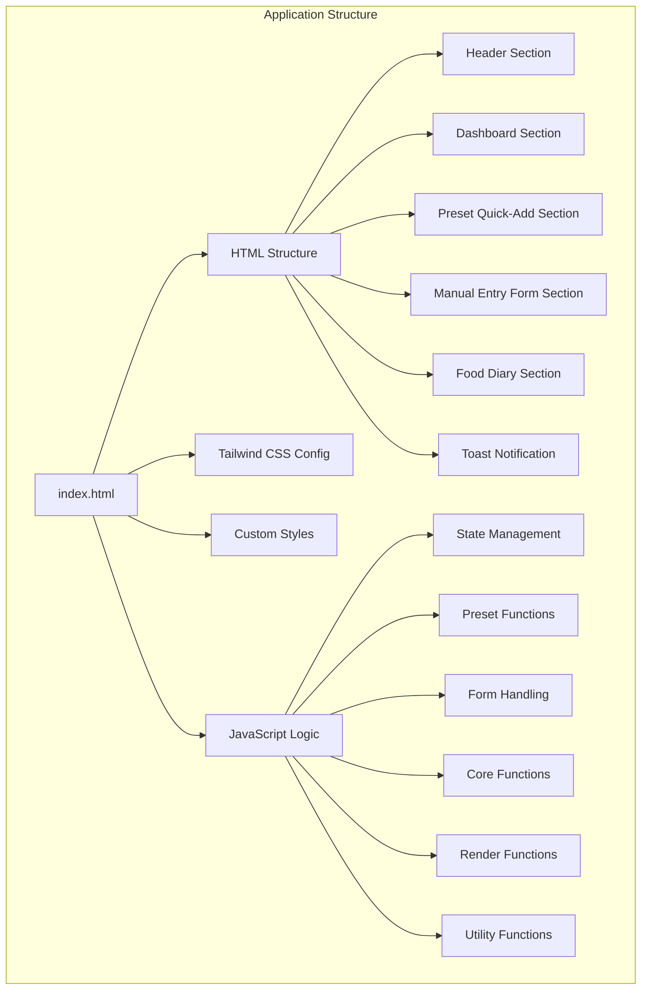
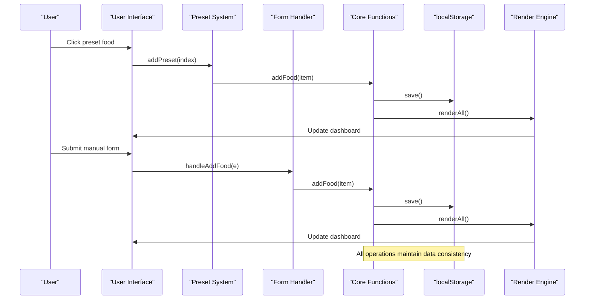
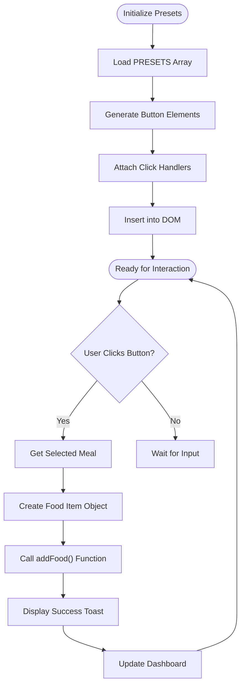
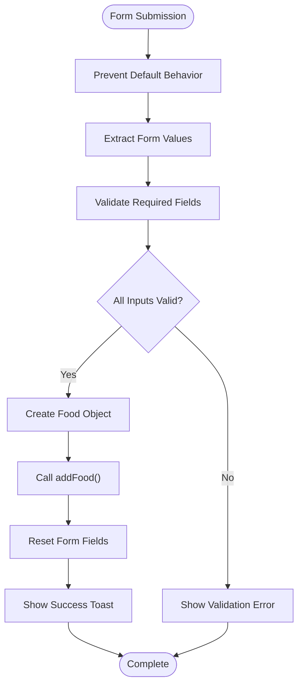
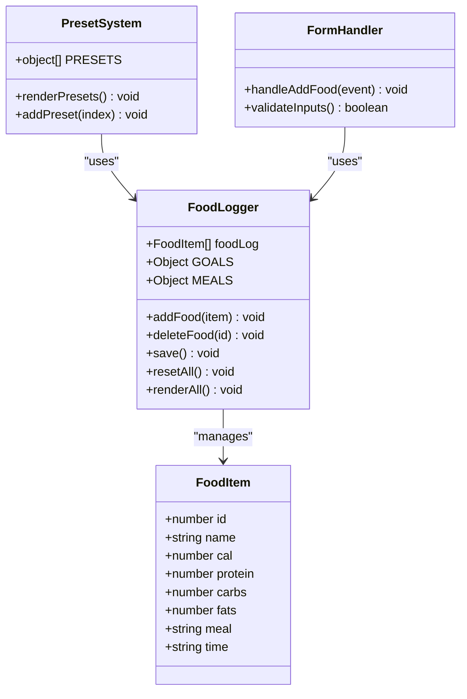
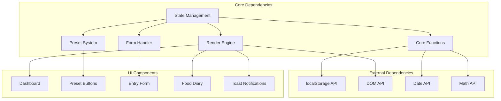

# Food Logging System

<cite>
**Referenced Files in This Document**
- [index.html](file://index.html)
</cite>

## Table of Contents
1. [Introduction](#introduction)
2. [Project Structure](#project-structure)
3. [Core Components](#core-components)
4. [Architecture Overview](#architecture-overview)
5. [Detailed Component Analysis](#detailed-component-analysis)
6. [Dependency Analysis](#dependency-analysis)
7. [Performance Considerations](#performance-considerations)
8. [Troubleshooting Guide](#troubleshooting-guide)
9. [Conclusion](#conclusion)

## Introduction

The NutriTrack food logging system is a comprehensive single-page web application designed to help users track their daily nutritional intake with a focus on Thai cuisine. The system provides two primary methods for logging food: quick preset additions featuring 8 common Thai foods and a manual food entry form with validation. The application features real-time nutritional tracking, visual progress indicators, and persistent data storage using localStorage.

The system is built with modern web technologies including HTML5, CSS3 with Tailwind CSS framework, and vanilla JavaScript, providing an intuitive user interface for dietary management and weight loss tracking.

## Project Structure

The NutriTrack application follows a single-file architecture pattern, consolidating all functionality within one HTML file. This approach simplifies deployment while maintaining clear separation between presentation, styling, and logic layers.

**Diagram sources**
- [index.html:1-478](file://index.html#L1-L478)

**Section sources**
- [index.html:1-478](file://index.html#L1-L478)

## Core Components

The food logging system consists of several interconnected components that work together to provide a seamless user experience:

### State Management
The application maintains its state through global variables and localStorage persistence. The core state includes nutritional goals, meal categories, preset food items, and the current food log entries.

### Preset Food System
A dynamic button generation system that creates clickable food items from predefined Thai food presets. Each preset includes nutritional information and displays real-time calorie counts.

### Manual Entry Form
A comprehensive form with input validation for custom food entries, supporting all macronutrients and meal categorization.

### Data Processing Engine
Centralized functions for creating standardized food objects, managing the food log, and handling data persistence.

**Section sources**
- [index.html:289-304](file://index.html#L289-L304)
- [index.html:293-302](file://index.html#L293-L302)

## Architecture Overview

The application follows a reactive architecture pattern where user interactions trigger state updates, which then propagate through the rendering system to update the UI in real-time.

**Diagram sources**
- [index.html:330-335](file://index.html#L330-L335)
- [index.html:338-351](file://index.html#L338-L351)
- [index.html:354-360](file://index.html#L354-L360)

## Detailed Component Analysis

### Preset Food System

The preset system dynamically generates 8 common Thai food buttons with nutritional information display. The system uses a configuration array containing food metadata and renders interactive buttons with hover effects and click handlers.

#### Preset Data Structure
The preset system manages 8 specific Thai foods:
- Chicken breast (อกไก่นุ่ม) - High protein, low fat
- Chicken rice (ข้าวมันไก่) - Balanced meal
- Boiled eggs (ไข่ต้ม 1 ฟอง) - Protein source
- Whey protein (เวย์โปรตีน 1 สกู๊ป) - Supplement
- Sticky rice with grilled pork (ข้าวเหนียวหมูปิ้ง) - Traditional dish
- Papaya salad (ส้มตำ) - Light option
- Tom yum noodles (ก๋วยเตี๋ยวต้มยำ) - Soup-based meal
- Bananas (กล้วยหอม 1 ลูก) - Fruit snack

#### Dynamic Button Generation
The `renderPresets()` function creates interactive buttons with:
- Emoji icons for visual identification
- Food names in Thai language
- Calorie counts prominently displayed
- Macronutrient breakdown (Protein/Carbs/Fats)
- Hover animations and active states

**Diagram sources**
- [index.html:318-328](file://index.html#L318-L328)
- [index.html:330-335](file://index.html#L330-L335)

**Section sources**
- [index.html:293-302](file://index.html#L293-L302)
- [index.html:318-335](file://index.html#L318-L335)

### Manual Food Entry Form

The manual entry form provides comprehensive food logging capabilities with robust validation and real-time feedback.

#### Form Fields and Validation
The form includes six primary input fields:
- **Food Name**: Text input with required validation
- **Calories**: Numeric input with minimum value constraint
- **Meal Category**: Dropdown selection (breakfast, lunch, dinner, snack)
- **Protein**: Numeric input with decimal support
- **Carbohydrates**: Numeric input with decimal support  
- **Fats**: Numeric input with decimal support

#### Real-time Data Processing
The `handleAddFood()` function processes form submissions with:
- Input sanitization and type conversion
- Validation checks for required fields
- Automatic meal category assignment
- Integration with the core food logging system

**Diagram sources**
- [index.html:338-351](file://index.html#L338-L351)

**Section sources**
- [index.html:176-214](file://index.html#L176-L214)
- [index.html:338-351](file://index.html#L338-L351)

### Core Food Logging Function

The `addFood()` function serves as the central hub for all food logging operations, ensuring data consistency across both preset and manual entry methods.

#### Standardized Food Object Creation
Every food item is created with a consistent structure:
- **Unique ID**: Generated using timestamp + random number combination
- **Timestamp**: Local time formatted for Thai locale
- **Nutritional Data**: Calories, protein, carbohydrates, fats
- **Meal Category**: Assigned based on user selection or preset default
- **Name**: Food identifier for display purposes

#### Data Persistence and Rendering
The function handles:
- Food object creation with unique identifiers
- Timestamp generation for audit trails
- Data persistence to localStorage
- Complete UI re-rendering for real-time updates

**Diagram sources**
- [index.html:354-360](file://index.html#L354-L360)
- [index.html:289-304](file://index.html#L289-L304)

**Section sources**
- [index.html:354-360](file://index.html#L354-L360)

### Data Consistency and Integration

The system ensures seamless integration between preset and manual logging methods through:

#### Unified Data Model
Both logging methods create identical food object structures, ensuring consistent processing and display regardless of entry method.

#### Shared State Management
All operations modify the same `foodLog` array, guaranteeing data consistency across the entire application.

#### Synchronized Rendering
The `renderAll()` function provides a single source of truth for UI updates, preventing display inconsistencies.

#### Persistent Storage
Local storage operations ensure data survives page refreshes and browser restarts.

**Section sources**
- [index.html:354-380](file://index.html#L354-L380)
- [index.html:383-458](file://index.html#L383-L458)

## Dependency Analysis

The application demonstrates a clean dependency structure with minimal coupling between components:

**Diagram sources**
- [index.html:289-304](file://index.html#L289-L304)
- [index.html:354-380](file://index.html#L354-L380)

**Section sources**
- [index.html:289-304](file://index.html#L289-L304)
- [index.html:354-380](file://index.html#L354-L380)

## Performance Considerations

The application implements several performance optimizations:

### Efficient Rendering
- Selective DOM updates using template literals
- CSS transitions for smooth animations
- Debounced toast notifications to prevent excessive DOM manipulation

### Memory Management
- Single source of truth for food data
- Efficient array operations for filtering and mapping
- Proper cleanup of event listeners and timers

### Storage Optimization
- JSON serialization for efficient localStorage usage
- Minimal data structure design
- Batch updates for complex operations

## Troubleshooting Guide

### Common Issues and Solutions

#### Data Persistence Problems
- **Issue**: Food entries not saving after page refresh
- **Solution**: Check localStorage availability and permissions
- **Debug**: Verify `save()` function execution and error handling

#### Form Validation Errors
- **Issue**: Form submission failing silently
- **Solution**: Check browser console for validation errors
- **Debug**: Verify input field IDs and event listener attachment

#### Preset Button Malfunction
- **Issue**: Preset buttons not responding to clicks
- **Solution**: Check event listener registration and index parameters
- **Debug**: Verify PRESETS array integrity and DOM element existence

#### Display Inconsistencies
- **Issue**: Dashboard not updating after food addition
- **Solution**: Ensure `renderAll()` is called after data modifications
- **Debug**: Check for JavaScript errors in the rendering pipeline

**Section sources**
- [index.html:369-380](file://index.html#L369-L380)
- [index.html:461-471](file://index.html#L461-L471)

## Conclusion

The NutriTrack food logging system provides a comprehensive solution for dietary tracking with particular emphasis on Thai cuisine. The dual-entry system accommodates both quick logging through presets and detailed manual entry, ensuring flexibility for different user preferences and scenarios.

The implementation demonstrates solid software engineering principles including:
- Clean separation of concerns between UI, logic, and data layers
- Robust error handling and user feedback mechanisms
- Efficient data persistence and real-time updates
- Responsive design with smooth user interactions

The system's architecture supports future enhancements such as additional preset categories, advanced nutritional analysis, and export functionality while maintaining backward compatibility and data integrity.