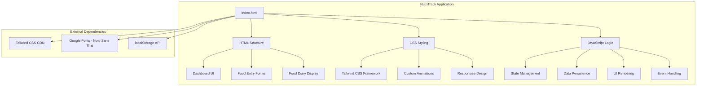
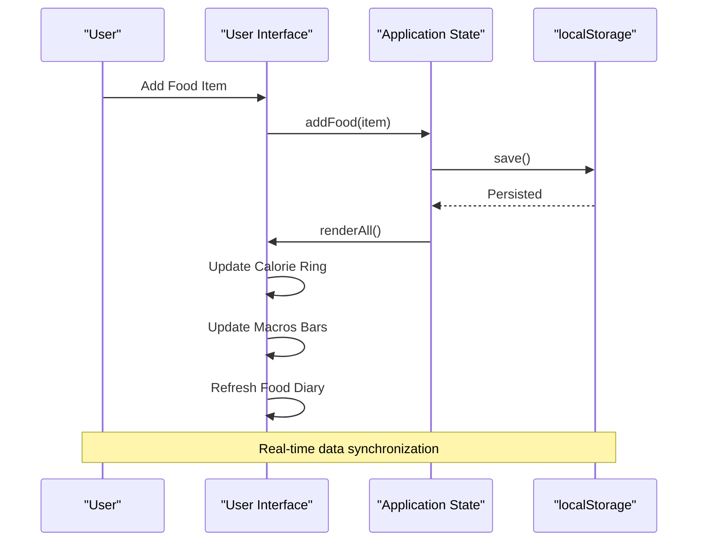
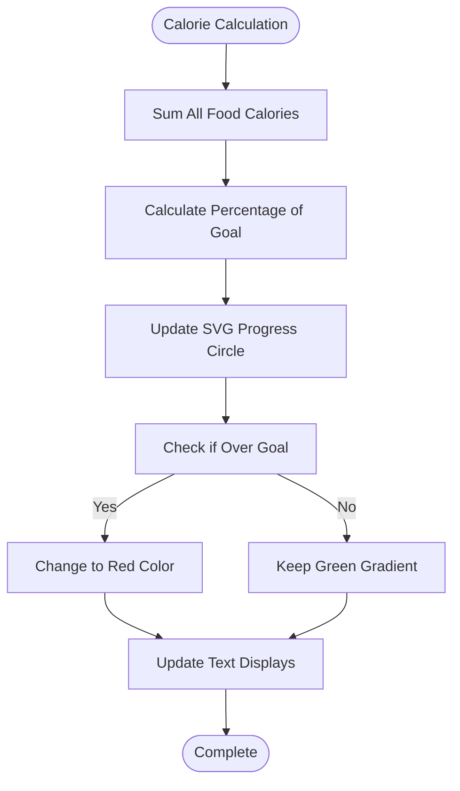
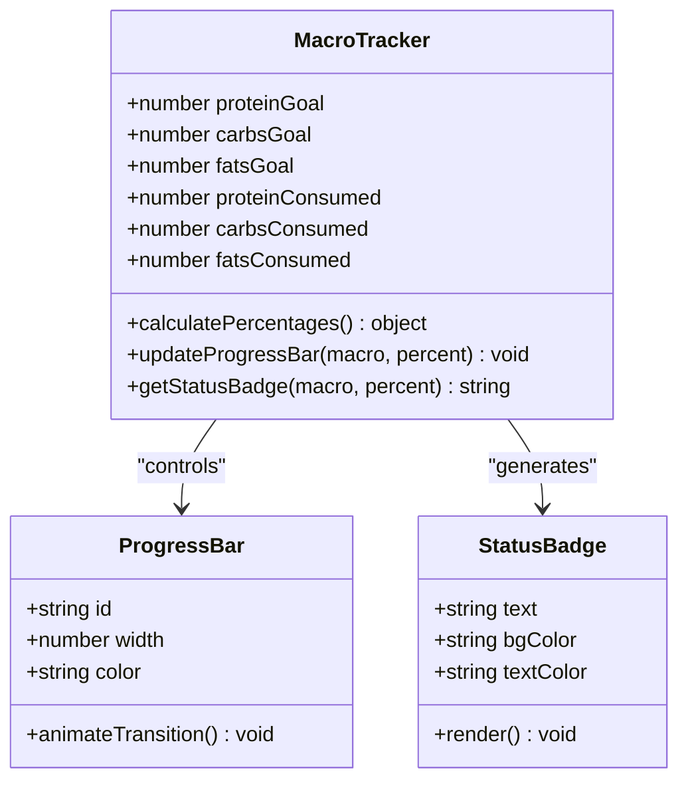
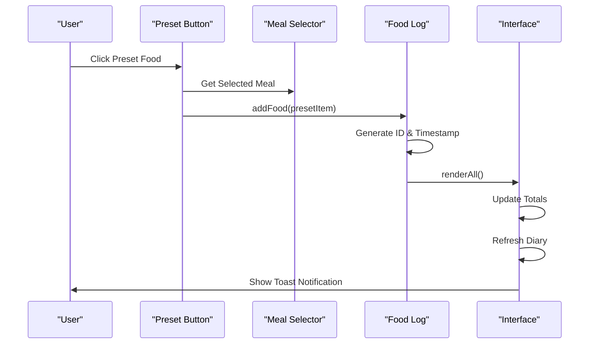
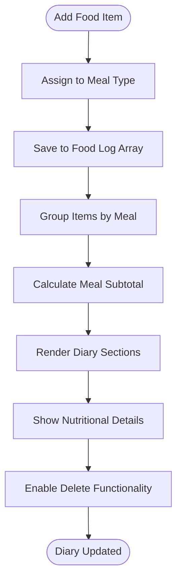

# Project Overview

<cite>
**Referenced Files in This Document**
- [index.html](file://index.html)
</cite>

## Table of Contents
1. [Introduction](#introduction)
2. [Project Structure](#project-structure)
3. [Core Components](#core-components)
4. [Architecture Overview](#architecture-overview)
5. [Detailed Component Analysis](#detailed-component-analysis)
6. [Dependency Analysis](#dependency-analysis)
7. [Performance Considerations](#performance-considerations)
8. [Troubleshooting Guide](#troubleshooting-guide)
9. [Conclusion](#conclusion)

## Introduction

NutriTrack is a comprehensive Thai-language nutrition and calorie tracking web application specifically designed to help users manage their weight loss journey through effective dietary monitoring. Built as a modern, responsive single-page application, NutriTrack provides an intuitive interface for tracking daily food intake, monitoring macronutrient consumption, and maintaining nutritional goals.

The application serves as a personal nutrition companion that combines visual data representation with practical food logging capabilities. Users can track their caloric intake, monitor protein, carbohydrates, and fat consumption, and organize their meals throughout the day. The Thai language interface ensures accessibility for the target demographic while providing professional-grade nutritional tracking features.

### Target Audience

NutriTrack is designed for individuals seeking to:
- Monitor daily caloric intake for weight management
- Track macronutrient ratios (protein, carbs, fats)
- Maintain organized food diaries
- Set and achieve nutritional goals
- Understand their eating patterns and habits

The application caters to both beginners who need simple, guided nutrition tracking and experienced users who require detailed macro monitoring and goal setting capabilities.

## Project Structure

NutriTrack follows a streamlined single-file architecture that consolidates all application logic, styling, and markup into one cohesive HTML document. This approach ensures easy deployment and maintenance while providing a complete user experience.



**Diagram sources**
- [index.html:1-478](file://index.html#L1-L478)

The application structure consists of three main layers:
- **Presentation Layer**: HTML markup and Tailwind CSS classes for responsive design
- **Styling Layer**: Custom CSS animations and component-specific styles
- **Logic Layer**: JavaScript functions for state management, data persistence, and UI updates

**Section sources**
- [index.html:1-478](file://index.html#L1-L478)

## Core Components

NutriTrack implements several key components that work together to provide comprehensive nutrition tracking functionality:

### Calorie Ring Visualization
The interactive calorie ring serves as the primary visual indicator of daily progress toward caloric goals. This circular progress visualization dynamically updates based on consumed calories versus the set goal, providing immediate feedback on dietary adherence.

### Macronutrient Monitoring System
The macros tracking system monitors protein, carbohydrates, and fat intake through individual progress bars and percentage indicators. Each macronutrient has customizable targets and real-time progress visualization.

### Quick Food Addition System
The preset foods feature provides rapid meal logging through predefined food items with accurate nutritional information. Users can quickly add common foods without manual data entry.

### Manual Food Entry Interface
For custom foods not available in presets, the application provides a comprehensive form for entering nutritional details including calories, protein, carbs, and fats.

### Organized Food Diary
The food diary organizes logged meals by time periods (breakfast, lunch, dinner, snacks) with detailed nutritional breakdowns and deletion capabilities.

### Data Persistence Engine
All user data is automatically saved to localStorage, ensuring information persists across browser sessions without requiring server infrastructure.

**Section sources**
- [index.html:68-104](file://index.html#L68-L104)
- [index.html:106-156](file://index.html#L106-L156)
- [index.html:159-173](file://index.html#L159-L173)
- [index.html:175-214](file://index.html#L175-L214)
- [index.html:216-275](file://index.html#L216-L275)
- [index.html:369-371](file://index.html#L369-L371)

## Architecture Overview

NutriTrack employs a client-side only architecture that leverages modern web technologies to deliver a seamless nutrition tracking experience. The application follows a unidirectional data flow pattern where user interactions trigger state updates, which then propagate to the UI layer.



**Diagram sources**
- [index.html:354-360](file://index.html#L354-L360)
- [index.html:383-458](file://index.html#L383-L458)

The architecture consists of four primary layers:

### Presentation Layer
Handles all user interface elements including the calorie ring, macro bars, food forms, and diary display. Uses Tailwind CSS for responsive design and custom CSS for animations.

### State Management Layer
Maintains application state including food logs, nutritional goals, and current calculations. Implements reactive updates to ensure UI consistency.

### Data Persistence Layer
Manages local storage operations for saving and retrieving food logs. Provides automatic backup and recovery of user data.

### Business Logic Layer
Contains core algorithms for nutritional calculations, goal tracking, and data validation. Ensures data integrity and consistent behavior across all operations.

**Section sources**
- [index.html:288-475](file://index.html#L288-L475)

## Detailed Component Analysis

### Calorie Ring Component

The calorie ring is the centerpiece of NutriTrack's visual interface, providing an at-a-glance view of daily caloric progress. This SVG-based component uses CSS custom properties for smooth animations and dynamic updates.



**Diagram sources**
- [index.html:392-412](file://index.html#L392-L412)

The component calculates the percentage of calories consumed relative to the daily goal and updates the SVG circle's stroke-dashoffset property for smooth animation. When users exceed their goal, the ring color changes from green to red for immediate visual feedback.

### Macro Tracking System

The macronutrient monitoring system tracks protein, carbohydrates, and fat intake through individual progress bars with percentage calculations and status indicators.



**Diagram sources**
- [index.html:106-156](file://index.html#L106-L156)
- [index.html:413-426](file://index.html#L413-L426)

Each macronutrient maintains separate goals and consumption tracking, with real-time progress bar updates and percentage badges showing completion status.

### Preset Foods System

The quick-add feature provides pre-configured food items with accurate nutritional information, streamlining the food logging process for common meals and snacks.



**Diagram sources**
- [index.html:330-335](file://index.html#L330-L335)
- [index.html:354-360](file://index.html#L354-L360)

The preset system includes popular Thai foods with realistic nutritional values, making it easy for users to log common meals without manual calculation.

### Food Diary Management

The food diary organizes logged items by meal type with detailed nutritional breakdowns and management capabilities.



**Diagram sources**
- [index.html:428-457](file://index.html#L428-L457)

Each meal section displays individual food items with their nutritional content, timestamps, and delete functionality for easy management.

**Section sources**
- [index.html:68-104](file://index.html#L68-L104)
- [index.html:106-156](file://index.html#L106-L156)
- [index.html:159-173](file://index.html#L159-L173)
- [index.html:216-275](file://index.html#L216-L275)

## Dependency Analysis

NutriTrack maintains minimal external dependencies while leveraging modern web APIs for optimal performance and reliability.

```mermaid
graph TB
subgraph "Internal Dependencies"
A[State Management] --> B[Data Persistence]
A --> C[UI Rendering]
B --> C
C --> D[Event Handlers]
end
subgraph "External Dependencies"
E[Tailwind CSS CDN]
F[Google Fonts API]
G[Browser localStorage]
H[SVG DOM API]
I[CSS Custom Properties]
end
A --> E
A --> F
A --> G
C --> H
C --> I
subgraph "Browser APIs"
G
H
I
]
```

**Diagram sources**
- [index.html:7-18](file://index.html#L7-L18)
- [index.html:20-40](file://index.html#L20-L40)
- [index.html:304-371](file://index.html#L304-L371)

### External Dependencies

**Tailwind CSS Framework**: Provides utility-first CSS classes for responsive design and consistent styling across all components.

**Google Fonts**: Loads the Noto Sans Thai font family for proper Thai language rendering and improved readability.

**Browser localStorage**: Enables client-side data persistence without requiring server infrastructure or database connections.

### Internal Dependencies

The application follows a modular architecture where each component has clear responsibilities and minimal coupling:

- **State Management**: Centralized data handling for food logs and nutritional calculations
- **Data Persistence**: Local storage operations for data backup and recovery
- **UI Rendering**: Reactive updates to reflect state changes across all visual components
- **Event Handling**: User interaction processing and response coordination

**Section sources**
- [index.html:7-18](file://index.html#L7-L18)
- [index.html:20-40](file://index.html#L20-L40)
- [index.html:288-475](file://index.html#L288-L475)

## Performance Considerations

NutriTrack is optimized for performance through several key strategies:

### Efficient Data Operations
- Minimal DOM manipulation through batched updates
- Optimized array operations for food log management
- Efficient calculation algorithms for nutritional totals

### Memory Management
- Automatic cleanup of event listeners and timers
- Efficient use of CSS custom properties for animations
- Proper garbage collection through object lifecycle management

### Browser Optimization
- Single-file architecture reduces HTTP requests
- Inline CSS eliminates additional stylesheet loading
- Client-side processing minimizes server dependency

### Responsive Design
- Mobile-first approach ensures optimal performance on all devices
- Touch-friendly interface elements for mobile users
- Adaptive layouts that maintain functionality across screen sizes

## Troubleshooting Guide

### Common Issues and Solutions

**Data Not Persisting**
- Verify browser localStorage is enabled
- Check for browser privacy settings that may block storage
- Clear browser cache and reload the application

**Calorie Ring Not Updating**
- Ensure food items are properly added to the log
- Check that nutritional values are correctly entered
- Verify browser console for JavaScript errors

**Thai Font Display Issues**
- Confirm internet connection for Google Fonts loading
- Check browser font support for Thai characters
- Try refreshing the page to reload font resources

**Mobile Interface Problems**
- Ensure viewport meta tag is present
- Test touch interactions on different devices
- Verify responsive breakpoints are working correctly

### Performance Optimization Tips

- Regularly clear old food logs to maintain performance
- Use preset foods when possible to reduce input overhead
- Monitor browser memory usage during extended sessions
- Consider implementing pagination for large food diaries

## Conclusion

NutriTrack represents a comprehensive solution for Thai-language nutrition tracking, combining intuitive design with powerful functionality. The application successfully bridges the gap between complex nutritional science and everyday usability, providing users with the tools they need to achieve their health and fitness goals.

Through its innovative calorie ring visualization, comprehensive macro tracking, and streamlined food logging system, NutriTrack delivers a professional-grade nutrition tracking experience in a lightweight, accessible package. The single-file architecture ensures easy deployment while maintaining full functionality, making it an ideal solution for individuals seeking effective dietary management tools.

The application's focus on Thai language support and culturally relevant food options demonstrates thoughtful consideration of its target audience, while the technical implementation showcases modern web development best practices. Whether users are beginning their weight loss journey or managing long-term dietary goals, NutriTrack provides the foundation for sustainable healthy eating habits.