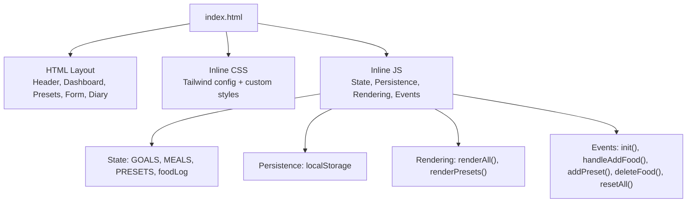
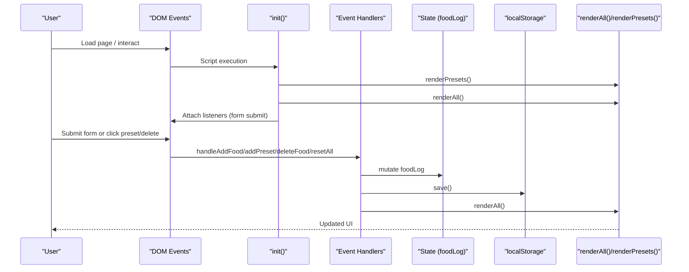
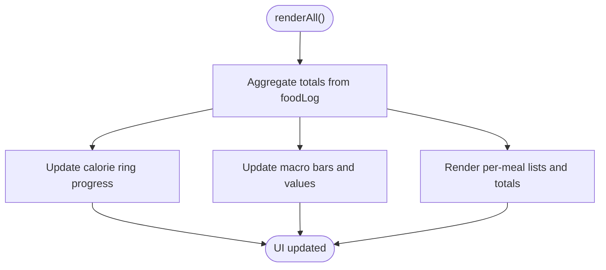
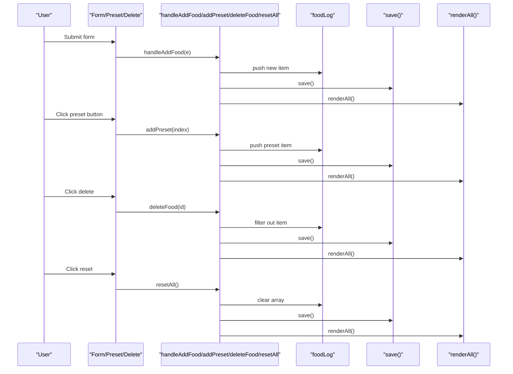
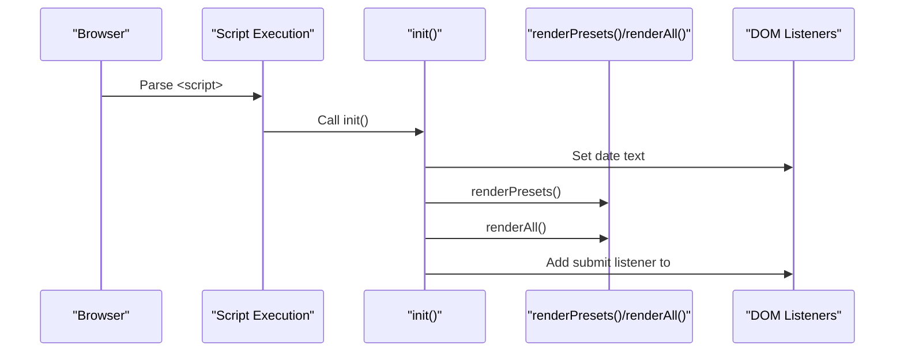
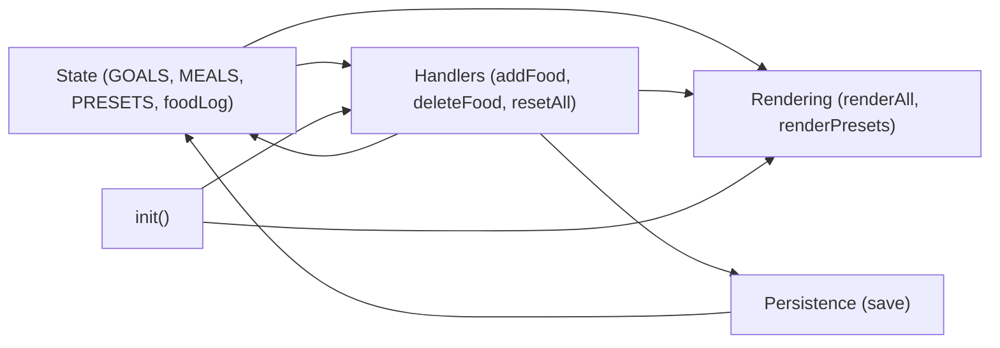

# Application Architecture

<cite>
**Referenced Files in This Document**
- [index.html](file://index.html)
</cite>

## Table of Contents
1. [Introduction](#introduction)
2. [Project Structure](#project-structure)
3. [Core Components](#core-components)
4. [Architecture Overview](#architecture-overview)
5. [Detailed Component Analysis](#detailed-component-analysis)
6. [Dependency Analysis](#dependency-analysis)
7. [Performance Considerations](#performance-considerations)
8. [Troubleshooting Guide](#troubleshooting-guide)
9. [Conclusion](#conclusion)

## Introduction
NutriTrack is a single-page application (SPA) implemented as a monolithic, single-file web app. All HTML markup, CSS styles, and JavaScript logic are contained within one index.html file. This approach is well-suited for simple applications where minimal deployment complexity and fast load times are priorities. The app provides daily calorie and macro tracking with preset food items, quick-add forms, and a persistent food diary using browser storage.

The design emphasizes:
- A module pattern that encapsulates functionality within functions
- An observer-like update mechanism centered on a central renderAll() function
- An event-driven architecture driven by DOM events
- Clear separation between state management, UI rendering, data persistence, and event handling

## Project Structure
The entire application lives in a single file:
- HTML structure defines the layout and UI regions (dashboard, presets, form, diary)
- Inline CSS configures Tailwind theme extensions and custom animations
- Inline JavaScript implements state, persistence, rendering, and event handling

**Diagram sources**
- [index.html:1-478](file://index.html#L1-L478)

**Section sources**
- [index.html:1-478](file://index.html#L1-L478)

## Core Components
This section outlines the main building blocks and their responsibilities.

- State Management
  - Global constants define goals and meal labels; an array holds the day’s food entries.
  - Responsibilities: hold current application state, provide defaults, and expose data to other components.

- Data Persistence Layer
  - Reads from and writes to localStorage under a dedicated key.
  - Responsibilities: serialize/deserialize the food log and ensure durability across sessions.

- UI Rendering Engine
  - Centralized renderAll() computes totals and updates all UI elements (calorie ring, macros bars, per-meal lists).
  - Dedicated renderPresets() builds preset buttons once during initialization.
  - Responsibilities: transform state into DOM updates consistently.

- Event Handlers
  - DOM listeners attach to the form submit and inline handlers for presets and deletion.
  - Responsibilities: translate user actions into state mutations and trigger re-renders.

- Initialization Flow
  - init() sets up date display, renders presets, attaches event listeners, and performs the first full render.

**Section sources**
- [index.html:289-304](file://index.html#L289-L304)
- [index.html:306-315](file://index.html#L306-L315)
- [index.html:317-335](file://index.html#L317-L335)
- [index.html:337-351](file://index.html#L337-L351)
- [index.html:353-380](file://index.html#L353-L380)
- [index.html:382-458](file://index.html#L382-L458)
- [index.html:460-471](file://index.html#L460-L471)
- [index.html:473-474](file://index.html#L473-L474)

## Architecture Overview
The application follows a monolithic, event-driven architecture with a central render loop.

**Diagram sources**
- [index.html:306-315](file://index.html#L306-L315)
- [index.html:317-335](file://index.html#L317-L335)
- [index.html:337-351](file://index.html#L337-L351)
- [index.html:353-380](file://index.html#L353-L380)
- [index.html:382-458](file://index.html#L382-L458)

## Detailed Component Analysis

### State Management Module
- Purpose: Holds immutable configuration (goals, meal labels), mutable runtime data (foodLog), and exposes them to other modules.
- Key elements:
  - GOALS: target calories and macros
  - MEALS: human-readable labels for each meal type
  - PRESETS: curated list of common foods with nutritional values
  - foodLog: array of daily entries persisted to localStorage
- Complexity:
  - Aggregation over foodLog is O(n) per renderAll() call
  - Filtering by meal is O(n) per meal group
- Optimization opportunities:
  - Cache computed totals when only one item changes
  - Use typed arrays or structured data if performance becomes critical

**Section sources**
- [index.html:289-304](file://index.html#L289-L304)

### Data Persistence Layer
- Purpose: Ensures foodLog survives page reloads via localStorage.
- Operations:
  - save(): serializes foodLog and writes to storage
  - Initial load: parses stored JSON into foodLog at startup
- Error handling:
  - Uses default empty array when storage is missing or invalid
- Extension points:
  - Swap storage backend (IndexedDB, sync API) without changing UI logic

**Section sources**
- [index.html:304](file://index.html#L304)
- [index.html:369-371](file://index.html#L369-L371)

### UI Rendering Engine
- Purpose: Translates state into consistent UI updates.
- Functions:
  - renderAll(): aggregates totals, updates calorie ring, macro bars, per-meal lists, and status badges
  - renderPresets(): builds preset buttons once during initialization
- Patterns:
  - Observer-like: callers mutate state then invoke renderAll() to refresh UI
  - Single source of truth for UI updates prevents inconsistent states
- Performance:
  - Full DOM patching per change; acceptable for small datasets
  - Animations rely on CSS transitions for smoothness

**Diagram sources**
- [index.html:382-458](file://index.html#L382-L458)

**Section sources**
- [index.html:317-328](file://index.html#L317-L328)
- [index.html:382-458](file://index.html#L382-L458)

### Event Handlers and Interaction Layer
- Purpose: Bridge user interactions to state mutations and re-renders.
- Handlers:
  - handleAddFood(): validates inputs, creates a new food entry, persists, and re-renders
  - addPreset(index): reads selected meal, adds a preset item, shows toast, and re-renders
  - deleteFood(id): removes an entry by id, persists, and re-renders
  - resetAll(): clears all data after confirmation, persists, and re-renders
- Event wiring:
  - init() attaches form submit listener
  - Inline onclick attributes wire preset and delete actions

**Diagram sources**
- [index.html:306-315](file://index.html#L306-L315)
- [index.html:317-335](file://index.html#L317-L335)
- [index.html:337-351](file://index.html#L337-L351)
- [index.html:353-380](file://index.html#L353-L380)
- [index.html:382-458](file://index.html#L382-L458)

**Section sources**
- [index.html:306-315](file://index.html#L306-L315)
- [index.html:317-335](file://index.html#L317-L335)
- [index.html:337-351](file://index.html#L337-L351)
- [index.html:353-380](file://index.html#L353-L380)

### Initialization Flow
- Responsibilities:
  - Set current date display
  - Build preset buttons
  - Attach event listeners
  - Perform initial render
- Entry point:
  - init() is invoked immediately at script end to bootstrap the app

**Diagram sources**
- [index.html:306-315](file://index.html#L306-L315)
- [index.html:473-474](file://index.html#L473-L474)

**Section sources**
- [index.html:306-315](file://index.html#L306-L315)
- [index.html:473-474](file://index.html#L473-L474)

### Notification System (Toast)
- Purpose: Provide brief feedback for user actions.
- Behavior:
  - Shows message, auto-hides after a timeout, debounces subsequent calls
- Integration:
  - Called from handlers after successful operations

**Section sources**
- [index.html:460-471](file://index.html#L460-L471)

## Dependency Analysis
High-level dependencies among components:

**Diagram sources**
- [index.html:289-304](file://index.html#L289-L304)
- [index.html:306-315](file://index.html#L306-L315)
- [index.html:353-380](file://index.html#L353-L380)
- [index.html:382-458](file://index.html#L382-L458)
- [index.html:369-371](file://index.html#L369-L371)

Key observations:
- Cohesion: Each function has a focused responsibility (state mutation, persistence, rendering, event handling).
- Coupling: Handlers depend on both state and persistence; rendering depends on state. This is appropriate for a single-file app.
- No circular dependencies: Data flows unidirectionally from handlers to state to persistence to rendering.

**Section sources**
- [index.html:289-304](file://index.html#L289-L304)
- [index.html:306-315](file://index.html#L306-L315)
- [index.html:353-380](file://index.html#L353-L380)
- [index.html:382-458](file://index.html#L382-L458)
- [index.html:369-371](file://index.html#L369-L371)

## Performance Considerations
- Rendering strategy:
  - renderAll() recomputes totals and rebuilds lists on every change. For small datasets this is efficient enough.
- DOM updates:
  - Uses innerHTML for list sections; consider virtualization or incremental updates if the dataset grows significantly.
- Storage:
  - localStorage serialization occurs on each mutation; batched writes could reduce overhead if needed.
- Animations:
  - CSS transitions keep UI responsive; avoid heavy synchronous work in event handlers.

[No sources needed since this section provides general guidance]

## Troubleshooting Guide
Common issues and remedies:
- Food not appearing:
  - Verify form validation passes and addFood is called.
  - Check that renderAll() runs after state mutation.
- Totals not updating:
  - Ensure save() and renderAll() are invoked after any state change.
- Data lost after reload:
  - Confirm localStorage is available and not blocked; check initial parse fallback.
- Preset not added:
  - Validate presetMealSelect value and that addPreset triggers addFood.

**Section sources**
- [index.html:337-351](file://index.html#L337-L351)
- [index.html:353-380](file://index.html#L353-L380)
- [index.html:382-458](file://index.html#L382-L458)
- [index.html:304](file://index.html#L304)

## Conclusion
NutriTrack demonstrates a clean, maintainable single-file SPA architecture. By encapsulating logic in focused functions, centralizing UI updates through renderAll(), and wiring interactions via DOM events, it achieves clarity and simplicity suitable for lightweight use cases. The modular boundaries—state, persistence, rendering, and events—provide clear extension points for adding features such as export/import, advanced analytics, or alternative storage backends while preserving the monolithic convenience.