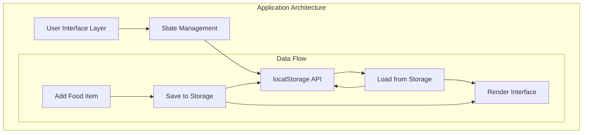
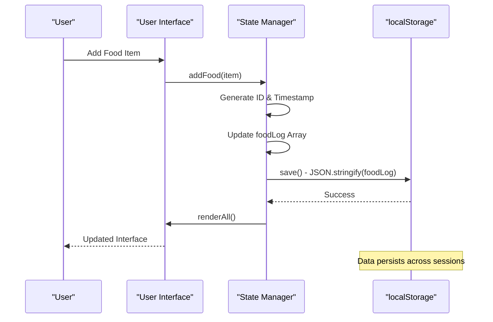
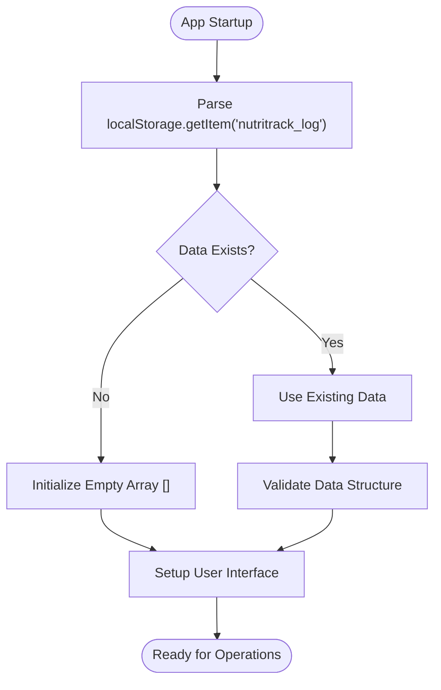
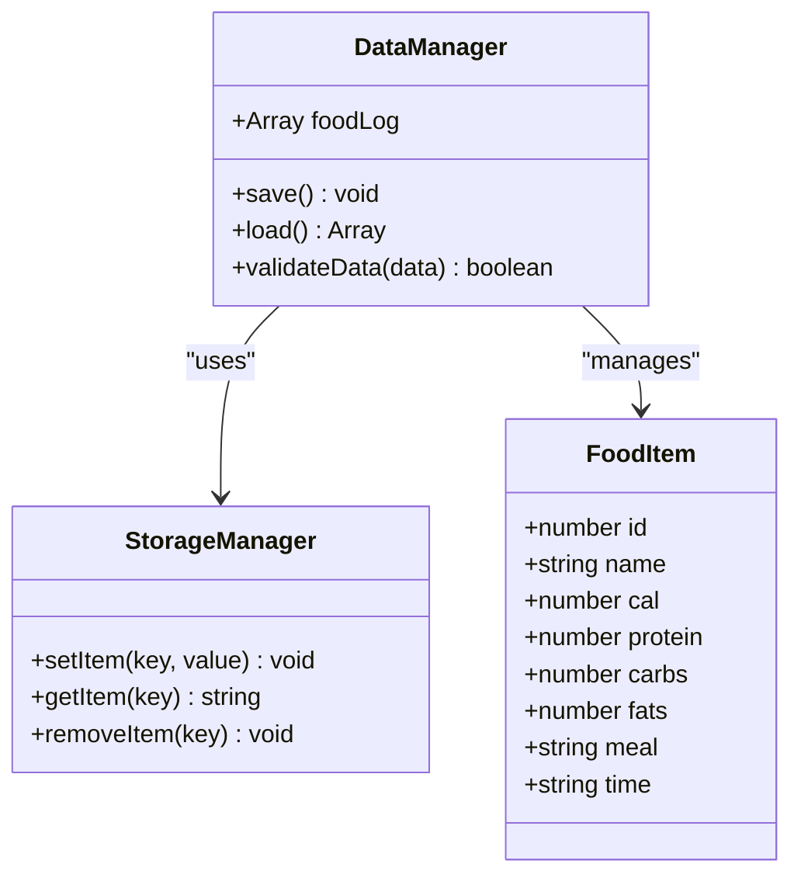
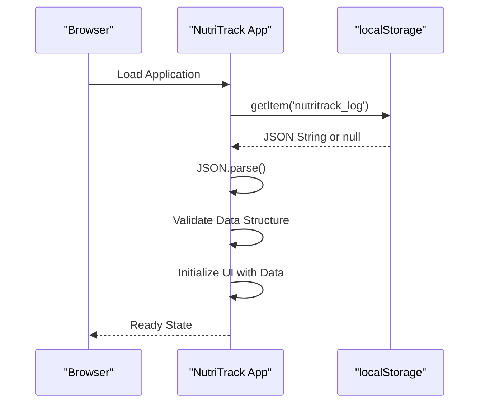
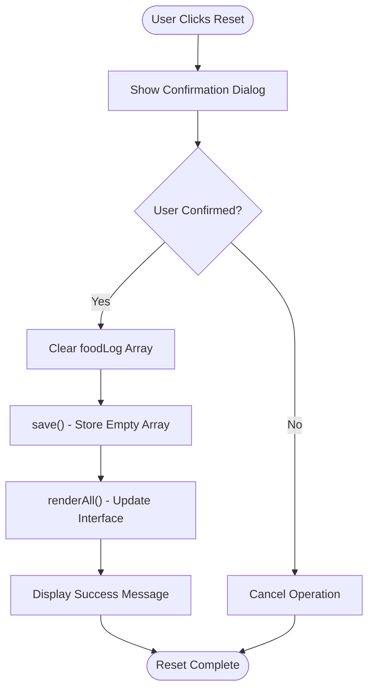
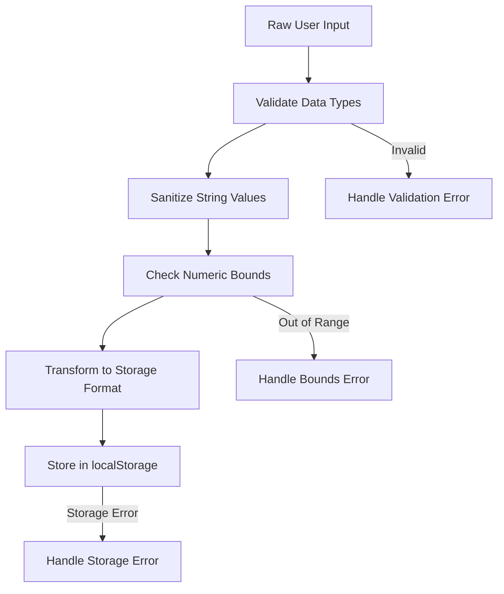

# Data Persistence

<cite>
**Referenced Files in This Document**
- [index.html](file://index.html)
</cite>

## Table of Contents
1. [Introduction](#introduction)
2. [Project Structure](#project-structure)
3. [Core Components](#core-components)
4. [Architecture Overview](#architecture-overview)
5. [Detailed Component Analysis](#detailed-component-analysis)
6. [Data Structure Format](#data-structure-format)
7. [Error Handling Strategies](#error-handling-strategies)
8. [Performance Considerations](#performance-considerations)
9. [Best Practices](#best-practices)
10. [Troubleshooting Guide](#troubleshooting-guide)
11. [Conclusion](#conclusion)

## Introduction

NutriTrack is a comprehensive nutrition tracking web application that implements a robust data persistence layer using the browser's localStorage API. The application provides users with the ability to track their daily food intake, monitor caloric consumption, and manage macronutrient goals through an intuitive Thai-language interface.

The data persistence system is built around a single-file architecture that manages all state management, user interactions, and data storage operations. This document focuses specifically on the data persistence layer, examining how the application maintains user data across sessions, handles data serialization and deserialization, and ensures data integrity throughout the application lifecycle.

## Project Structure

The NutriTrack application follows a single-page application (SPA) architecture implemented entirely within a single HTML file. The data persistence layer is integrated directly into the JavaScript logic, providing seamless data management without requiring external dependencies or complex build processes.



**Diagram sources**
- [index.html:288-475](file://index.html#L288-L475)

**Section sources**
- [index.html:1-478](file://index.html#L1-L478)

## Core Components

The data persistence layer consists of several key components that work together to provide reliable data storage and retrieval functionality:

### Primary Data Structures

The application maintains a central `foodLog` array that serves as the source of truth for all nutritional data. This array contains individual food items with unique identifiers, timestamps, and nutritional information.

### Storage Functions

The core storage functions include:
- **save()**: Serializes the foodLog array to JSON format and stores it under the 'nutritrack_log' key
- **Initialization process**: Loads existing data from localStorage during app startup
- **resetAll()**: Provides complete data reset functionality with confirmation dialogs

### Data Processing Pipeline

The application implements a complete data processing pipeline that handles validation, transformation, and persistence operations while maintaining data consistency across the user interface.

**Section sources**
- [index.html:304-380](file://index.html#L304-L380)

## Architecture Overview

The data persistence architecture follows a unidirectional data flow pattern where all state changes are processed through centralized functions before being persisted to storage.



**Diagram sources**
- [index.html:354-371](file://index.html#L354-L371)

## Detailed Component Analysis

### Data Initialization Process

The initialization process occurs immediately when the application loads, establishing the foundation for all subsequent data operations.

#### Initialization Sequence



**Diagram sources**
- [index.html:304-315](file://index.html#L304-L315)

The initialization process begins by attempting to retrieve existing data from localStorage using the key 'nutritrack_log'. If no data exists or if the stored data is invalid, the application initializes with an empty array. This approach ensures the application always starts with valid data structure.

### Data Saving Mechanism

The save() function serves as the primary interface for persisting data changes to localStorage.

#### Save Function Implementation



**Diagram sources**
- [index.html:369-371](file://index.html#L369-L371)

The save() function performs JSON serialization of the entire foodLog array and stores it under the consistent key 'nutritrack_log'. This approach ensures atomic updates and maintains data consistency across all application features.

### Data Recovery Mechanism

When users return to the application, the data recovery mechanism automatically restores their previous session data, providing a seamless user experience.

#### Recovery Process



**Diagram sources**
- [index.html:304-315](file://index.html#L304-L315)

The recovery process handles both successful data retrieval and error scenarios gracefully, ensuring the application remains functional even when localStorage is unavailable or corrupted.

### Complete Reset Functionality

The resetAll() function provides users with the ability to clear all tracked data while maintaining application stability.

#### Reset Operation Flow



**Diagram sources**
- [index.html:373-380](file://index.html#L373-L380)

The reset functionality includes user confirmation to prevent accidental data loss and provides immediate feedback through toast notifications.

**Section sources**
- [index.html:304-380](file://index.html#L304-L380)

## Data Structure Format

The application uses a well-defined data structure for food items that balances simplicity with comprehensive nutritional tracking capabilities.

### Food Item Schema

Each food item in the foodLog array follows this structure:

| Property | Type | Description | Generation Method |
|----------|------|-------------|-------------------|
| `id` | number | Unique identifier for the food item | `Date.now() + Math.random()` |
| `name` | string | Name of the food item | User input or preset selection |
| `cal` | number | Calorie content in kcal | User input or preset value |
| `protein` | number | Protein content in grams | User input or preset value |
| `carbs` | number | Carbohydrate content in grams | User input or preset value |
| `fats` | number | Fat content in grams | User input or preset value |
| `meal` | string | Meal category (breakfast/lunch/dinner/snack) | User selection or preset default |
| `time` | string | Time of entry in Thai locale format | `new Date().toLocaleTimeString('th-TH', ...)` |

### ID Generation Strategy

The application generates unique IDs using a combination of timestamp and random number generation:

```javascript
item.id = Date.now() + Math.random();
```

This approach provides:
- **Temporal uniqueness**: Based on current millisecond timestamp
- **Collision avoidance**: Random component reduces probability of duplicates
- **Sequential ordering**: Items maintain chronological order by default

### Timestamp Formatting

Time entries use Thai locale formatting to provide culturally appropriate time displays:

```javascript
item.time = new Date().toLocaleTimeString('th-TH', { 
    hour: '2-digit', 
    minute: '2-digit' 
});
```

This ensures consistent time display across different browser environments while maintaining Thai language preferences.

**Section sources**
- [index.html:354-357](file://index.html#L354-L357)

## Error Handling Strategies

The data persistence layer implements multiple layers of error handling to ensure application stability and data integrity.

### localStorage Availability Detection

The application handles cases where localStorage might be unavailable due to browser restrictions, privacy settings, or storage quotas.

### Data Validation and Sanitization

Before storing data, the application validates input values and sanitizes strings to prevent data corruption:



**Diagram sources**
- [index.html:338-351](file://index.html#L338-L351)

### Graceful Degradation

When storage operations fail, the application continues to function normally in memory while displaying appropriate error messages to users.

**Section sources**
- [index.html:338-380](file://index.html#L338-L380)

## Performance Considerations

The data persistence layer is optimized for performance while maintaining data consistency and reliability.

### Efficient Serialization

The application uses JSON.stringify() for efficient data serialization, which provides optimal performance for the expected data volume in a personal nutrition tracker.

### Minimal Storage Operations

Storage operations are batched appropriately to minimize localStorage access frequency while ensuring data durability.

### Memory Management

The application maintains a clean separation between in-memory state and persistent storage, allowing for efficient UI updates without unnecessary re-parsing of stored data.

## Best Practices

The NutriTrack implementation follows established best practices for localStorage usage in web applications:

### Data Consistency

- **Atomic Updates**: All data changes go through centralized functions
- **Validation Before Storage**: Input validation prevents corrupted data
- **Consistent Keys**: Single key ('nutritrack_log') for all related data

### User Experience

- **Immediate Feedback**: Toast notifications confirm successful operations
- **Confirmation Dialogs**: Critical operations like reset require explicit confirmation
- **Graceful Errors**: Application remains functional even when storage fails

### Security Considerations

- **Input Sanitization**: Prevents potential XSS attacks through data validation
- **No Sensitive Data**: Only non-sensitive nutritional data is stored
- **Client-Side Only**: No server communication for data persistence

## Troubleshooting Guide

Common issues and their solutions when working with the NutriTrack data persistence layer:

### Storage Quota Exceeded

If users encounter storage quota errors, they can:
1. Clear browser data for the site
2. Use the resetAll() function to reduce data size
3. Clear older entries manually through the deleteFood() function

### Data Corruption Recovery

If stored data becomes corrupted:
1. The application automatically falls back to empty data structure
2. Users can export important data before clearing
3. Browser developer tools can inspect localStorage contents

### Cross-Browser Compatibility

The application uses standard localStorage APIs that are supported across all modern browsers. For legacy browser support, consider implementing fallback storage mechanisms.

## Conclusion

NutriTrack's data persistence layer demonstrates a robust and user-friendly implementation of browser localStorage functionality. The system successfully balances simplicity with comprehensive data management capabilities, providing users with reliable data persistence while maintaining excellent performance and user experience.

The implementation showcases best practices for client-side data storage, including proper error handling, data validation, and user feedback mechanisms. The single-file architecture makes the system easy to understand, maintain, and extend while providing all necessary functionality for a personal nutrition tracking application.

The modular design of the persistence layer allows for future enhancements such as data export/import functionality, advanced search capabilities, or integration with cloud storage services while maintaining backward compatibility with existing data structures.