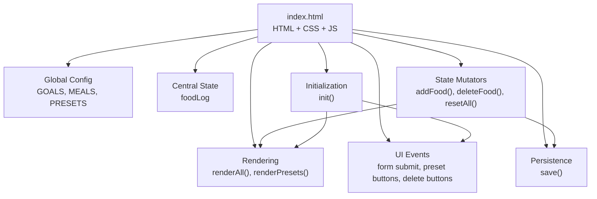
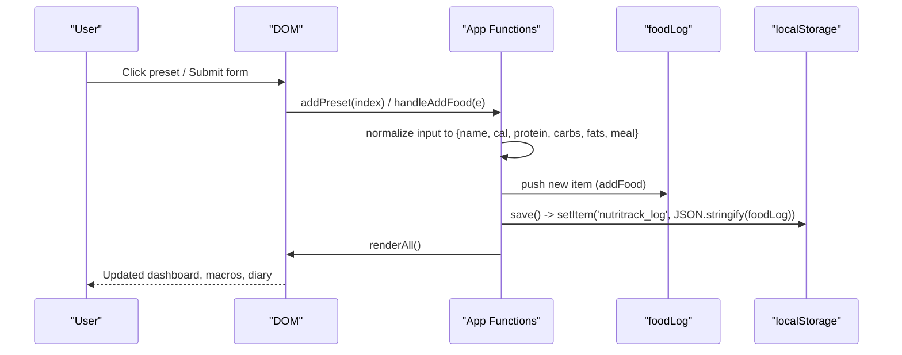
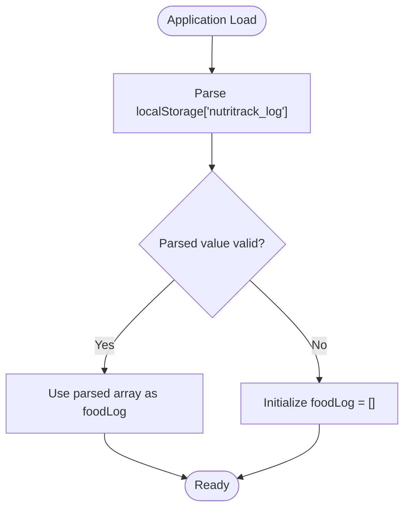
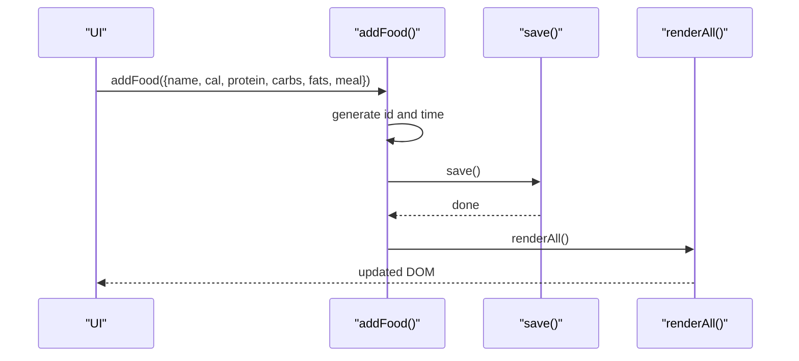
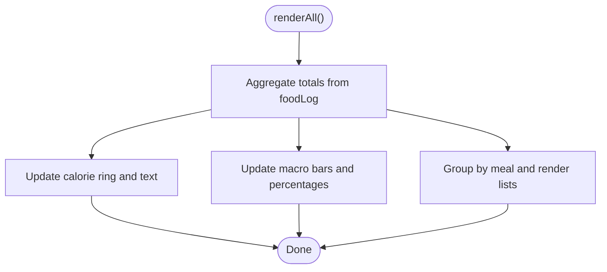
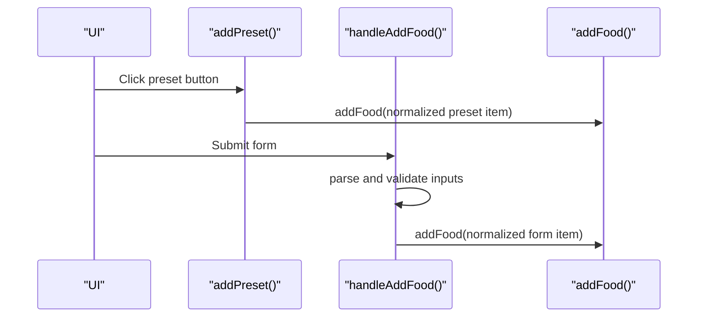
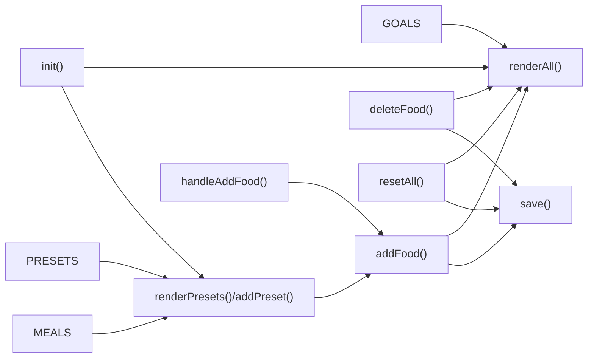

# State Management

<cite>
**Referenced Files in This Document**
- [index.html](file://index.html)
</cite>

## Table of Contents
1. [Introduction](#introduction)
2. [Project Structure](#project-structure)
3. [Core Components](#core-components)
4. [Architecture Overview](#architecture-overview)
5. [Detailed Component Analysis](#detailed-component-analysis)
6. [Dependency Analysis](#dependency-analysis)
7. [Performance Considerations](#performance-considerations)
8. [Troubleshooting Guide](#troubleshooting-guide)
9. [Conclusion](#conclusion)

## Introduction
NutriTrack implements a simple, global-variable-based state management system within a single-page HTML application. The app tracks daily nutritional intake against configurable goals, supports quick-add presets for common Thai foods, and persists user data to localStorage. State mutations are performed through dedicated functions that update the central foodLog array, persist changes, and trigger UI re-rendering via a centralized renderAll function.

## Project Structure
The entire application is contained in a single HTML file with embedded CSS and JavaScript. The script section defines:
- Global configuration constants (goals, meal labels, preset foods)
- Central mutable state (foodLog)
- Initialization routine
- State mutation functions (addFood, deleteFood, resetAll)
- Persistence helper (save)
- Rendering logic (renderAll, renderPresets)
- Event wiring and startup

**Diagram sources**
- [index.html:288-475](file://index.html#L288-L475)

**Section sources**
- [index.html:288-475](file://index.html#L288-L475)

## Core Components
This section documents the core state objects and lifecycle.

- GOALS object
  - Purpose: Defines daily targets for calories, protein, carbs, and fats.
  - Values: calories: 1800, protein: 120g, carbs: 150g, fats: 50g.
  - Usage: Consumed by rendering logic to compute progress percentages and remaining/overage values.

- MEALS configuration
  - Purpose: Maps meal keys to localized display names.
  - Keys: breakfast, lunch, dinner, snack.
  - Usage: Used when labeling preset additions and potentially elsewhere for display.

- PRESETS array
  - Purpose: Provides eight common Thai foods with pre-filled nutritional info for quick-add.
  - Fields per item: name, cal, p (protein), c (carbs), f (fats), emoji.
  - Usage: Rendered as quick-add buttons; clicking an item calls addFood with normalized fields.

- foodLog array
  - Purpose: Central data store for all logged food items.
  - Item shape: { id, name, cal, protein, carbs, fats, meal, time }.
  - Lifecycle: Initialized from localStorage on load; mutated via addFood/deleteFood/resetAll; persisted via save().

- State persistence
  - Key: 'nutritrack_log' in localStorage.
  - Format: JSON stringified array of food items.

- Observer-like pattern
  - There is no formal observer registry. Instead, state mutations call renderAll() after updating foodLog, which acts as a manual observer: it recomputes totals and updates DOM elements.

Concrete examples of state structure and validation rules:
- Example food item structure:
  - id: unique numeric identifier generated at add time
  - name: non-empty string
  - cal, protein, carbs, fats: numbers (parsed from inputs or preset values)
  - meal: one of "breakfast", "lunch", "dinner", "snack"
  - time: localized time string recorded at add time
- Validation rules:
  - Name must be non-empty before adding.
  - Numeric fields default to 0 if empty or invalid.
  - Meal selection is constrained by the form select options.

**Section sources**
- [index.html:290-304](file://index.html#L290-L304)
- [index.html:338-351](file://index.html#L338-L351)
- [index.html:354-367](file://index.html#L354-L367)
- [index.html:369-371](file://index.html#L369-L371)
- [index.html:383-458](file://index.html#L383-L458)

## Architecture Overview
The architecture follows a minimal reactive model:
- Global constants define configuration.
- Central state (foodLog) is the source of truth.
- Mutators update state, persist, then trigger full re-render.
- renderAll computes aggregates and updates the DOM.

**Diagram sources**
- [index.html:330-335](file://index.html#L330-L335)
- [index.html:338-351](file://index.html#L338-L351)
- [index.html:354-360](file://index.html#L354-L360)
- [index.html:369-371](file://index.html#L369-L371)
- [index.html:383-458](file://index.html#L383-L458)

## Detailed Component Analysis

### Global Configuration
- GOALS
  - Holds daily targets used to compute progress and overages.
  - Referenced during rendering to calculate percentages and color changes when exceeding targets.
- MEALS
  - Provides human-readable labels for meal categories.
  - Used when showing feedback messages after adding preset items.
- PRESETS
  - Array of eight predefined foods with nutritional values.
  - Rendered into quick-add buttons; each click maps preset fields to the canonical food item shape and adds via addFood.

**Section sources**
- [index.html:290-302](file://index.html#L290-L302)
- [index.html:318-335](file://index.html#L318-L335)

### Central State and Persistence
- foodLog
  - Initialized by parsing localStorage under key 'nutritrack_log'. If absent, starts as an empty array.
  - Each entry includes id, name, cal, protein, carbs, fats, meal, and time.
- save()
  - Serializes foodLog to JSON and writes to localStorage under 'nutritrack_log'.
- resetAll()
  - Clears foodLog, persists, and re-renders.

**Diagram sources**
- [index.html:304](file://index.html#L304)
- [index.html:369-371](file://index.html#L369-L371)
- [index.html:373-380](file://index.html#L373-L380)

**Section sources**
- [index.html:304](file://index.html#L304)
- [index.html:369-371](file://index.html#L369-L371)
- [index.html:373-380](file://index.html#L373-L380)

### State Mutations
- addFood(item)
  - Assigns a unique id and a localized time.
  - Pushes item into foodLog.
  - Persists via save().
  - Triggers renderAll() to update UI.
- deleteFood(id)
  - Filters out the item with matching id.
  - Persists via save().
  - Triggers renderAll() to update UI.
- resetAll()
  - Empties foodLog, persists, and re-renders.

**Diagram sources**
- [index.html:354-360](file://index.html#L354-L360)
- [index.html:369-371](file://index.html#L369-L371)
- [index.html:383-458](file://index.html#L383-L458)

**Section sources**
- [index.html:354-367](file://index.html#L354-L367)
- [index.html:369-371](file://index.html#L369-L371)
- [index.html:373-380](file://index.html#L373-L380)

### Rendering and Observer Pattern
- renderAll()
  - Computes totals across foodLog for calories, protein, carbs, and fats.
  - Updates the calorie ring and macro bars using GOALS for percentage calculations.
  - Renders the food diary grouped by meal category.
  - Acts as the observer: called after every state mutation to reflect changes in the UI.

**Diagram sources**
- [index.html:383-458](file://index.html#L383-L458)

**Section sources**
- [index.html:383-458](file://index.html#L383-L458)

### Input Handling and Data Normalization
- Preset quick-add
  - renderPresets() builds buttons from PRESETS.
  - addPreset(index) reads selected meal and calls addFood with normalized fields.
- Manual form submission
  - handleAddFood(e) reads form fields, normalizes numeric values, validates name presence, and calls addFood.

**Diagram sources**
- [index.html:318-335](file://index.html#L318-L335)
- [index.html:338-351](file://index.html#L338-L351)
- [index.html:354-360](file://index.html#L354-L360)

**Section sources**
- [index.html:318-335](file://index.html#L318-L335)
- [index.html:338-351](file://index.html#L338-L351)
- [index.html:354-360](file://index.html#L354-L360)

## Dependency Analysis
- Constants depend on nothing; they are consumed by rendering and preset handling.
- foodLog depends on initialization from localStorage.
- addFood and deleteFood depend on foodLog and call save and renderAll.
- renderAll depends on GOALS and foodLog to compute and display metrics.
- UI event handlers depend on DOM elements and call state mutators.

**Diagram sources**
- [index.html:290-304](file://index.html#L290-L304)
- [index.html:318-335](file://index.html#L318-L335)
- [index.html:338-351](file://index.html#L338-L351)
- [index.html:354-367](file://index.html#L354-L367)
- [index.html:369-371](file://index.html#L369-L371)
- [index.html:373-380](file://index.html#L373-L380)
- [index.html:383-458](file://index.html#L383-L458)

**Section sources**
- [index.html:290-304](file://index.html#L290-L304)
- [index.html:318-335](file://index.html#L318-L335)
- [index.html:338-351](file://index.html#L338-L351)
- [index.html:354-367](file://index.html#L354-L367)
- [index.html:369-371](file://index.html#L369-L371)
- [index.html:373-380](file://index.html#L373-L380)
- [index.html:383-458](file://index.html#L383-L458)

## Performance Considerations
- Full re-render strategy: renderAll recomputes totals and rebuilds list sections on every mutation. For small datasets this is efficient enough; consider incremental updates if the log grows significantly.
- DOM operations: Using innerHTML for lists is concise but can cause reflows; batching or keyed updates could improve performance for large logs.
- LocalStorage writes: save() runs on every mutation; consider debouncing if batch operations are introduced.

[No sources needed since this section provides general guidance]

## Troubleshooting Guide
- Data not persisting
  - Ensure save() is invoked after any change to foodLog.
  - Verify localStorage availability and quota.
- UI not updating
  - Confirm renderAll() is called after state mutations.
  - Check that element IDs referenced by renderAll exist in the DOM.
- Duplicate or missing entries
  - Validate that addFood generates unique ids and that deleteFood filters by id correctly.
- Invalid inputs
  - Ensure numeric fields are parsed safely and default to 0 when empty.
  - Enforce non-empty name before calling addFood.

**Section sources**
- [index.html:354-367](file://index.html#L354-L367)
- [index.html:369-371](file://index.html#L369-L371)
- [index.html:383-458](file://index.html#L383-L458)

## Conclusion
NutriTrack’s state management relies on a straightforward global variable approach:
- GOALS, MEALS, and PRESETS provide configuration and convenience data.
- foodLog is the single source of truth, initialized from localStorage and mutated via addFood, deleteFood, and resetAll.
- save() ensures persistence, while renderAll serves as a manual observer to keep the UI in sync.
This design is simple, transparent, and effective for a lightweight nutrition tracker.