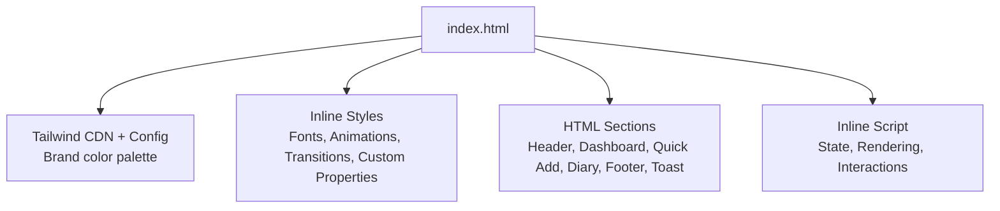
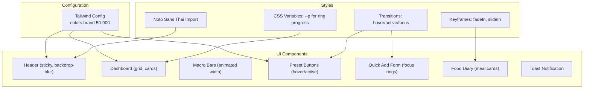
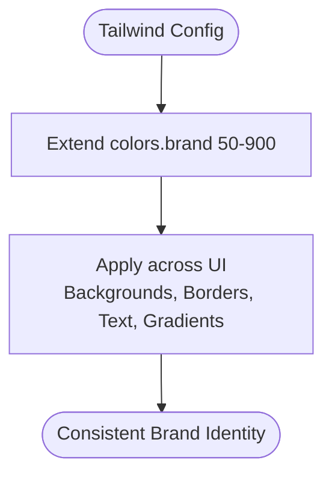
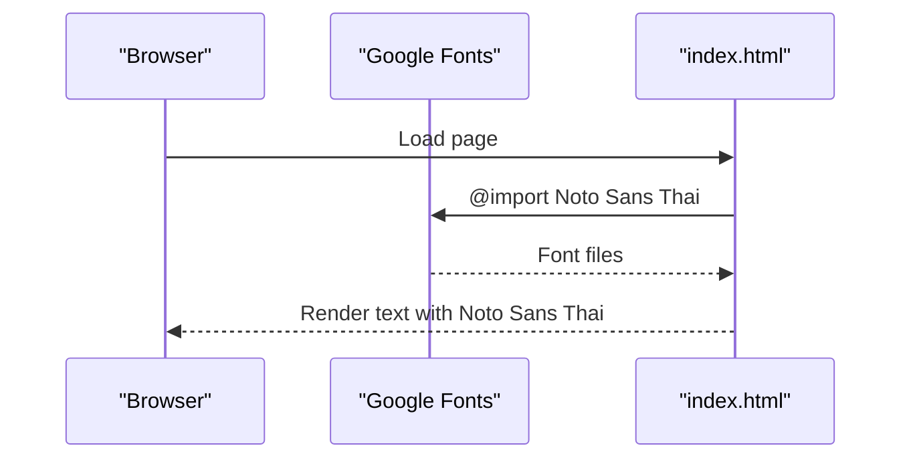
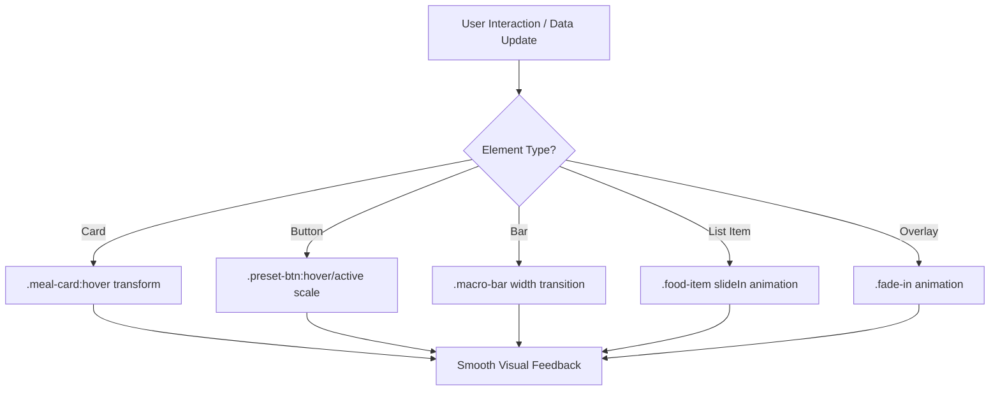
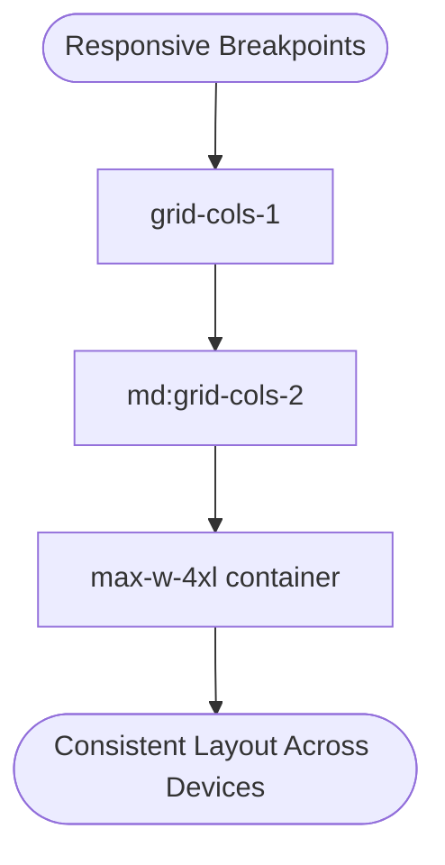
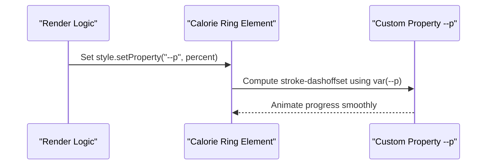
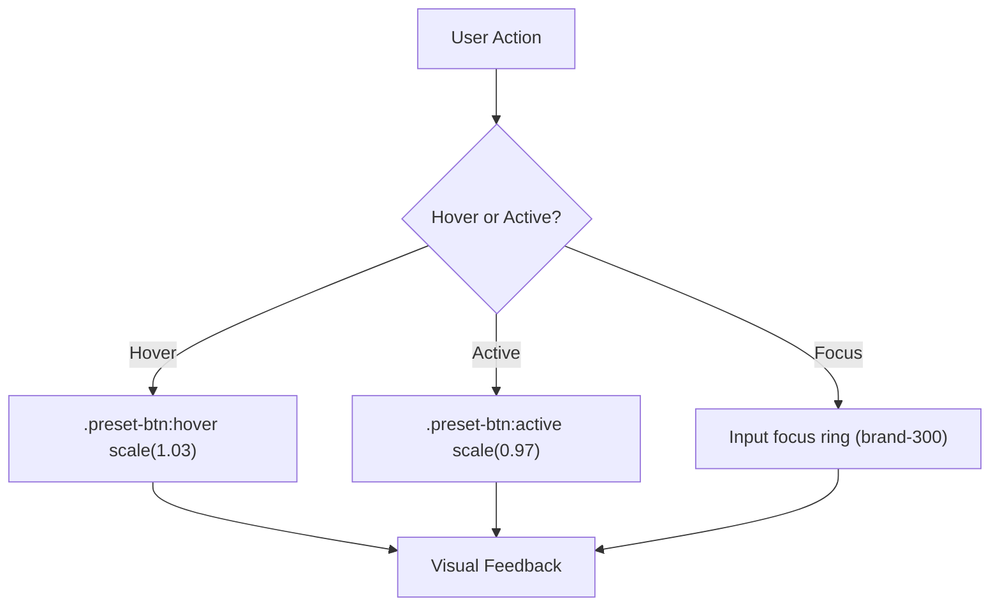
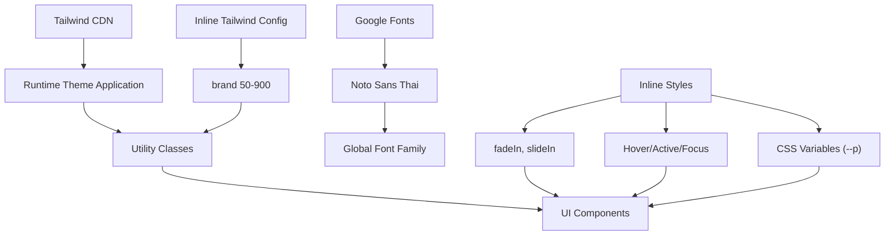

# Styling & Design System

<cite>
**Referenced Files in This Document**
- [index.html](file://index.html)
</cite>

## Table of Contents
1. [Introduction](#introduction)
2. [Project Structure](#project-structure)
3. [Core Components](#core-components)
4. [Architecture Overview](#architecture-overview)
5. [Detailed Component Analysis](#detailed-component-analysis)
6. [Dependency Analysis](#dependency-analysis)
7. [Performance Considerations](#performance-considerations)
8. [Troubleshooting Guide](#troubleshooting-guide)
9. [Conclusion](#conclusion)

## Introduction
This document explains the styling and design system used by NutriTrack, focusing on:
- Tailwind CSS theme extension with a green brand palette (brand-50 to brand-900)
- Noto Sans Thai font integration for Thai language support
- Custom CSS animations (fadeIn, slideIn) and smooth transitions for interactive elements
- Responsive design patterns using Tailwind’s grid and utility classes
- CSS custom properties approach for dynamic styling (e.g., --p for calorie ring progress)
- Hover/active states for buttons and cards
- Visual hierarchy principles, spacing conventions, and accessibility considerations embedded in the UI

The entire implementation is contained within a single HTML file that loads Tailwind via CDN and defines inline styles and scripts.

## Project Structure
NutriTrack uses a minimal structure with all styling and behavior defined in one file:
- index.html contains:
  - Tailwind CDN script and inline Tailwind configuration extending colors
  - Inline <style> block for fonts, animations, transitions, and custom properties
  - Semantic HTML sections for header, dashboard, quick-add, food diary, footer, and toast
  - Inline JavaScript for interactivity and rendering updates

**Diagram sources**
- [index.html:7-18](file://index.html#L7-L18)
- [index.html:19-40](file://index.html#L19-L40)
- [index.html:42-281](file://index.html#L42-L281)
- [index.html:288-475](file://index.html#L288-L475)

**Section sources**
- [index.html:1-478](file://index.html#L1-L478)

## Core Components
- Brand Color Palette (Tailwind Theme Extension)
  - Extends Tailwind with a green scale from brand-50 to brand-900 for consistent theming across backgrounds, borders, text, and gradients.
- Typography
  - Uses Noto Sans Thai with multiple weights for clear Thai language readability.
- Animations and Transitions
  - fadeIn and slideIn keyframes for subtle entry effects.
  - Smooth transitions for macro bars, meal cards, preset buttons, and focus rings.
- Dynamic Styling with CSS Custom Properties
  - Calorie ring uses --p to compute stroke-dashoffset for animated progress.
- Responsive Layouts
  - Grid-based layout with responsive breakpoints for mobile-first design.
- Interactive States
  - Hover and active transforms for buttons and cards; focus rings for inputs.

**Section sources**
- [index.html:9-17](file://index.html#L9-L17)
- [index.html:19-21](file://index.html#L19-L21)
- [index.html:22-37](file://index.html#L22-L37)
- [index.html:42-61](file://index.html#L42-L61)
- [index.html:66-157](file://index.html#L66-L157)
- [index.html:159-214](file://index.html#L159-L214)
- [index.html:216-281](file://index.html#L216-L281)

## Architecture Overview
The design system architecture integrates Tailwind utilities, custom CSS, and semantic HTML to deliver a cohesive visual experience. The flow below shows how configuration, styles, and components interact.

**Diagram sources**
- [index.html:9-17](file://index.html#L9-L17)
- [index.html:19-40](file://index.html#L19-L40)
- [index.html:42-281](file://index.html#L42-L281)

## Detailed Component Analysis

### Brand Color Palette Configuration
- Extends Tailwind with a green gradient-friendly palette:
  - brand-50 to brand-900 provide light-to-dark tones suitable for backgrounds, borders, and text.
- Usage examples include:
  - Background gradients (from-brand-50 to gray-50)
  - Borders and accents (border-brand-100)
  - Text emphasis (text-brand-600, text-brand-700)
  - Button gradients (from-brand-500 to-brand-600)

**Diagram sources**
- [index.html:9-17](file://index.html#L9-L17)
- [index.html:42-61](file://index.html#L42-L61)
- [index.html:210-213](file://index.html#L210-L213)

**Section sources**
- [index.html:9-17](file://index.html#L9-L17)
- [index.html:42-61](file://index.html#L42-L61)
- [index.html:210-213](file://index.html#L210-L213)

### Noto Sans Thai Font Integration
- Imports Noto Sans Thai with multiple weights for clarity and hierarchy.
- Applies globally to body for consistent typography across Thai content.

**Diagram sources**
- [index.html:19-21](file://index.html#L19-L21)

**Section sources**
- [index.html:19-21](file://index.html#L19-L21)

### Custom CSS Animations and Transitions
- Keyframes:
  - fadeIn: opacity and vertical translation for gentle entrance.
  - slideIn: horizontal translation for list items.
- Transitions:
  - Macro bars animate width changes smoothly.
  - Meal cards lift slightly on hover.
  - Preset buttons scale up on hover and down on active.
  - Inputs use focus rings for clear focus state.

**Diagram sources**
- [index.html:22-37](file://index.html#L22-L37)
- [index.html:28-33](file://index.html#L28-L33)
- [index.html:34-37](file://index.html#L34-L37)

**Section sources**
- [index.html:22-37](file://index.html#L22-L37)
- [index.html:28-33](file://index.html#L28-L33)
- [index.html:34-37](file://index.html#L34-L37)

### Responsive Design Patterns
- Grid system:
  - Single-column on small screens, two columns on medium+ screens for dashboard sections.
- Utility classes:
  - Spacing via gap and space-y for consistent rhythm.
  - Max-width containers for readability on larger screens.
  - Flexbox for alignment and distribution within cards and headers.

**Diagram sources**
- [index.html:66-66](file://index.html#L66-L66)
- [index.html:46-61](file://index.html#L46-L61)
- [index.html:63-63](file://index.html#L63-L63)

**Section sources**
- [index.html:66-66](file://index.html#L66-L66)
- [index.html:46-61](file://index.html#L46-L61)
- [index.html:63-63](file://index.html#L63-L63)

### CSS Custom Properties for Dynamic Styling
- Calorie ring progress:
  - Uses --p variable to compute stroke-dashoffset for SVG circle progress.
  - Transition applied for smooth animation when value changes.
- Macro bars:
  - Width updated dynamically via inline styles with CSS transitions.

**Diagram sources**
- [index.html:22-27](file://index.html#L22-L27)
- [index.html:392-403](file://index.html#L392-L403)

**Section sources**
- [index.html:22-27](file://index.html#L22-L27)
- [index.html:392-403](file://index.html#L392-L403)

### Hover and Active States
- Preset buttons:
  - Scale up on hover and scale down on active for tactile feedback.
- Meal cards:
  - Subtle upward translation on hover to indicate interactivity.
- Inputs:
  - Focus rings with brand-colored outlines for clear focus visibility.

**Diagram sources**
- [index.html:31-33](file://index.html#L31-L33)
- [index.html:29-30](file://index.html#L29-L30)
- [index.html:165-166](file://index.html#L165-L166)
- [index.html:182-208](file://index.html#L182-L208)

**Section sources**
- [index.html:31-33](file://index.html#L31-L33)
- [index.html:29-30](file://index.html#L29-L30)
- [index.html:165-166](file://index.html#L165-L166)
- [index.html:182-208](file://index.html#L182-L208)

### Visual Hierarchy Principles
- Typography:
  - Headings use uppercase tracking and muted colors for labels; primary values are bold and colored with brand tones.
- Spacing:
  - Consistent gaps and padding create clear separation between sections and items.
- Contrast:
  - High-contrast text for important numbers; subdued colors for secondary information.
- Emphasis:
  - Gradient backgrounds and shadows highlight key areas like the logo and primary actions.

**Section sources**
- [index.html:46-61](file://index.html#L46-L61)
- [index.html:69-104](file://index.html#L69-L104)
- [index.html:107-156](file://index.html#L107-L156)
- [index.html:216-281](file://index.html#L216-L281)

### Spacing Conventions
- Vertical rhythm:
  - space-y-6 between major sections.
- Horizontal rhythm:
  - gap-5 in grid layouts; gap-2 for preset buttons.
- Internal card spacing:
  - p-5 or p-6 for comfortable padding inside cards.

**Section sources**
- [index.html:63-63](file://index.html#L63-L63)
- [index.html:66-66](file://index.html#L66-L66)
- [index.html:172-172](file://index.html#L172-L172)
- [index.html:160-160](file://index.html#L160-L160)

### Accessibility Considerations
- Language attribute set to Thai for correct locale handling.
- Focus indicators:
  - Inputs have visible focus rings using brand colors.
- Color contrast:
  - Primary values use strong brand colors against light backgrounds.
- Semantic structure:
  - Use of header, main, section, and footer improves screen reader navigation.
- Reduced motion:
  - Transitions and animations are subtle and short to avoid overwhelming users.

**Section sources**
- [index.html:2-2](file://index.html#L2-L2)
- [index.html:165-166](file://index.html#L165-L166)
- [index.html:182-208](file://index.html#L182-L208)
- [index.html:42-61](file://index.html#L42-L61)

## Dependency Analysis
The styling system depends on external resources and internal configurations:
- External:
  - Tailwind CSS via CDN provides utility classes and runtime theme application.
  - Google Fonts serves Noto Sans Thai.
- Internal:
  - Inline Tailwind config extends the color palette.
  - Inline styles define animations, transitions, and custom properties.
  - HTML structure applies these styles semantically.

**Diagram sources**
- [index.html:7-18](file://index.html#L7-L18)
- [index.html:19-40](file://index.html#L19-L40)
- [index.html:42-281](file://index.html#L42-L281)

**Section sources**
- [index.html:7-18](file://index.html#L7-L18)
- [index.html:19-40](file://index.html#L19-L40)
- [index.html:42-281](file://index.html#L42-L281)

## Performance Considerations
- Prefer Tailwind utilities for layout and spacing to minimize custom CSS.
- Keep animations short and simple to maintain smooth interactions.
- Use CSS variables for dynamic values to reduce reflows and repaints.
- Avoid excessive box-shadows and heavy gradients on large surfaces.
- Ensure focus states remain lightweight and accessible.

[No sources needed since this section provides general guidance]

## Troubleshooting Guide
- Calorie ring not animating:
  - Verify --p is set correctly and the progress circle has the expected class and stroke settings.
- Fonts not loading:
  - Check network access to Google Fonts and ensure the import URL is reachable.
- Hover/active states not visible:
  - Confirm element classes (.preset-btn, .meal-card) are present and not overridden by other styles.
- Focus rings missing:
  - Ensure input elements retain focus styles and no global rules remove outline.

**Section sources**
- [index.html:22-27](file://index.html#L22-L27)
- [index.html:19-21](file://index.html#L19-L21)
- [index.html:31-33](file://index.html#L31-L33)
- [index.html:29-30](file://index.html#L29-L30)
- [index.html:165-166](file://index.html#L165-L166)

## Conclusion
NutriTrack’s design system combines Tailwind’s utility-first approach with targeted custom CSS to deliver a clean, responsive, and accessible interface. The green brand palette, Thai typography, subtle animations, and thoughtful spacing contribute to a cohesive user experience. By leveraging CSS custom properties and responsive grids, the system remains flexible and performant while maintaining strong visual hierarchy and interaction feedback.

[No sources needed since this section summarizes without analyzing specific files]