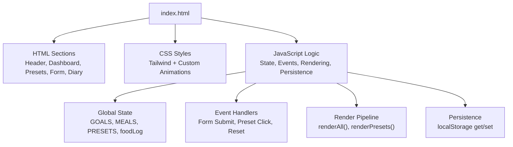
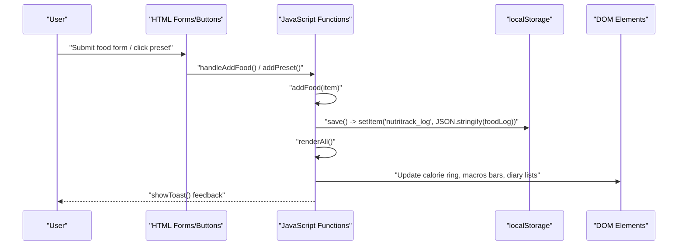
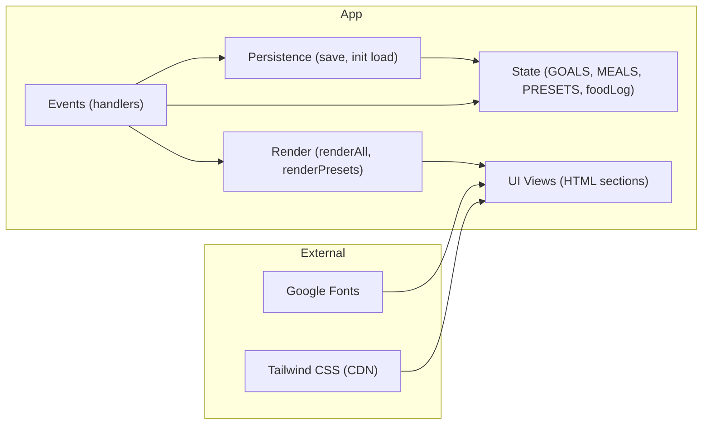

# Technical Implementation

<cite>
**Referenced Files in This Document**
- [index.html](file://index.html)
</cite>

## Table of Contents
1. [Introduction](#introduction)
2. [Project Structure](#project-structure)
3. [Core Components](#core-components)
4. [Architecture Overview](#architecture-overview)
5. [Detailed Component Analysis](#detailed-component-analysis)
6. [Dependency Analysis](#dependency-analysis)
7. [Performance Considerations](#performance-considerations)
8. [Troubleshooting Guide](#troubleshooting-guide)
9. [Conclusion](#conclusion)

## Introduction
NutriTrack is a single-page application (SPA) implemented entirely within one HTML file. It provides a calorie and macro tracker with preset food items, quick-add forms, and a visual dashboard including an animated SVG calorie ring and progress bars for protein, carbs, and fats. The app uses global state variables, event-driven rendering, and localStorage persistence to deliver a responsive, real-time user experience without any build step or external JavaScript frameworks.

## Project Structure
The project consists of a single file that contains:
- HTML markup for layout and UI sections
- CSS styles including Tailwind utility classes and custom animations
- JavaScript logic for state management, event handling, rendering, and persistence

**Diagram sources**
- [index.html:1-478](file://index.html#L1-L478)

**Section sources**
- [index.html:1-478](file://index.html#L1-L478)

## Core Components
This section documents the key building blocks of the application:

- Global State
  - GOALS: daily targets for calories, protein, carbs, and fats
  - MEALS: labels for meal categories
  - PRESETS: predefined food entries with macros
  - foodLog: array of logged food items persisted to localStorage

- Event-Driven Rendering System
  - renderAll(): central function that recalculates totals and updates all UI elements
  - renderPresets(): renders preset buttons dynamically from PRESETS

- Data Flow
  - User input via form triggers handleAddFood()
  - addFood() mutates foodLog and persists data
  - deleteFood() removes items and persists changes
  - resetAll() clears state and re-renders

- Persistence Layer
  - save(): writes foodLog to localStorage under a fixed key
  - Initialization reads existing log from localStorage

- UI Feedback
  - showToast(): displays transient notifications on actions

**Section sources**
- [index.html:288-304](file://index.html#L288-L304)
- [index.html:306-315](file://index.html#L306-L315)
- [index.html:317-335](file://index.html#L317-L335)
- [index.html:337-351](file://index.html#L337-L351)
- [index.html:353-380](file://index.html#L353-L380)
- [index.html:382-458](file://index.html#L382-L458)
- [index.html:460-471](file://index.html#L460-L471)

## Architecture Overview
The application follows a simple reactive pattern:
- State lives in global variables
- DOM elements are updated by render functions
- Events mutate state and then trigger re-rendering
- All changes are persisted to localStorage

**Diagram sources**
- [index.html:337-351](file://index.html#L337-L351)
- [index.html:353-360](file://index.html#L353-L360)
- [index.html:369-371](file://index.html#L369-L371)
- [index.html:382-458](file://index.html#L382-L458)
- [index.html:460-471](file://index.html#L460-L471)

## Detailed Component Analysis

### State Management
- GOALS defines target values for calories, protein, carbs, and fats used to compute percentages and remaining/over amounts.
- MEALS maps meal keys to display names used in presets and toast messages.
- PRESETS is a static list of common foods with macros; it drives the quick-add interface.
- foodLog is the source of truth for today’s entries; it is initialized from localStorage if available.

Key responsibilities:
- Centralized state simplifies cross-component access
- Minimal coupling between UI and logic
- Easy extension points by adding new goals or presets

Complexity considerations:
- Aggregation in renderAll() runs O(n) over foodLog per render
- No deep object graphs; flat arrays keep operations efficient

**Section sources**
- [index.html:288-304](file://index.html#L288-L304)

### Event Handling and Input Processing
- Form submission handler validates inputs, constructs a food item, and delegates to addFood().
- Preset button clicks read the selected meal and call addFood() with preset data.
- Delete actions remove an item by id and persist changes.
- Reset action clears all logs after confirmation.

Error handling and validation:
- Numeric fields default to 0 when empty
- Name field must be non-empty before saving
- Confirmation dialog prevents accidental resets

**Section sources**
- [index.html:337-351](file://index.html#L337-L351)
- [index.html:330-335](file://index.html#L330-L335)
- [index.html:362-367](file://index.html#L362-L367)
- [index.html:373-380](file://index.html#L373-L380)

### Rendering Engine (Observer-like Pattern)
Although there is no formal observer library, the app implements an observer-like pattern:
- State mutations call renderAll()
- renderAll() computes aggregates and updates specific DOM nodes by ID
- CSS transitions animate changes (calorie ring, macro bars, fade/slide-in effects)

Highlights:
- Calorie ring uses a CSS variable and stroke-dashoffset for smooth animation
- Macro bars update width based on percentage of goal
- Food diary lists rebuild per meal category with totals and per-item details

Performance notes:
- Single-pass aggregation reduces repeated calculations
- Direct element selection by ID avoids heavy queries
- Transitions are GPU-friendly where possible

**Section sources**
- [index.html:382-458](file://index.html#L382-L458)
- [index.html:19-40](file://index.html#L19-L40)

### Data Persistence with localStorage
- On initialization, foodLog is loaded from localStorage using a fixed key
- After every mutation (add, delete, reset), save() persists the current state
- This ensures data survives page reloads and browser restarts

Considerations:
- Storage size is limited by browser quotas; typical usage is small
- JSON serialization/deserialization overhead is minimal for this dataset

**Section sources**
- [index.html:304](file://index.html#L304)
- [index.html:369-371](file://index.html#L369-L371)

### SVG Animation System (Calorie Ring)
- An SVG circle represents the background track; another circle with class progress shows the consumed portion
- A CSS variable controls the dash offset to reflect percentage completion
- When consumption exceeds the goal, the stroke color switches to indicate overage

Accessibility and UX:
- Animated transitions provide immediate feedback
- Textual summaries complement the visual indicator

**Section sources**
- [index.html:22-27](file://index.html#L22-L27)
- [index.html:72-86](file://index.html#L72-L86)
- [index.html:392-411](file://index.html#L392-L411)

### Responsive Design with Tailwind CSS
- Utility-first classes define layout, spacing, typography, colors, and shadows
- Grid layouts adapt across breakpoints for mobile and desktop
- Brand palette is extended via Tailwind config embedded in the same file
- Hover and active states enhance interactivity

Customization points:
- Tailwind theme extension allows easy brand color adjustments
- Inline styles are minimized; most styling is declarative

**Section sources**
- [index.html:7-18](file://index.html#L7-L18)
- [index.html:42-281](file://index.html#L42-L281)

### Toast Notification System
- A floating notification appears briefly after actions like adding or deleting items
- Uses CSS transitions for opacity and transform to animate in/out
- A timer ensures automatic dismissal

**Section sources**
- [index.html:460-471](file://index.html#L460-L471)

## Dependency Analysis
Internal dependencies:
- UI sections depend on global state and render functions
- Event handlers depend on state mutation functions
- Persistence depends on the current state shape

External dependencies:
- Tailwind CSS via CDN for styling
- Google Fonts for Thai typography

**Diagram sources**
- [index.html:7-18](file://index.html#L7-L18)
- [index.html:288-304](file://index.html#L288-L304)
- [index.html:337-351](file://index.html#L337-L351)
- [index.html:382-458](file://index.html#L382-L458)
- [index.html:369-371](file://index.html#L369-L371)

**Section sources**
- [index.html:7-18](file://index.html#L7-L18)
- [index.html:288-304](file://index.html#L288-L304)
- [index.html:337-351](file://index.html#L337-L351)
- [index.html:382-458](file://index.html#L382-L458)
- [index.html:369-371](file://index.html#L369-L371)

## Performance Considerations
- Rendering cost is linear in the number of logged items; acceptable for typical daily use
- Avoid unnecessary re-renders by batching state changes when extending functionality
- Prefer direct ID-based DOM updates already used in renderAll()
- Keep localStorage payloads small; consider archiving older days if scaling beyond a single day view

[No sources needed since this section provides general guidance]

## Troubleshooting Guide
Common issues and resolutions:
- Data not persisting
  - Ensure save() is called after each mutation
  - Verify localStorage availability and quota
- UI not updating after changes
  - Confirm renderAll() is invoked post-mutation
  - Check that element IDs referenced in renderAll() exist in the DOM
- Over-limit visuals not changing
  - Validate that stroke color switch logic executes when totals exceed goals
- Form submissions ignored
  - Ensure required fields are filled and numeric fields parse correctly

Operational checks:
- Use browser DevTools to inspect localStorage contents
- Temporarily add console logs around addFood(), deleteFood(), and renderAll() to trace flows

**Section sources**
- [index.html:353-380](file://index.html#L353-L380)
- [index.html:382-458](file://index.html#L382-L458)

## Conclusion
NutriTrack demonstrates a clean, lightweight SPA architecture contained in a single file. By centralizing state, using event-driven rendering, and leveraging localStorage, it achieves real-time UI updates and persistent data with minimal complexity. The design offers clear extension points for additional features such as multi-day history, export/import, or advanced analytics while maintaining simplicity and performance.