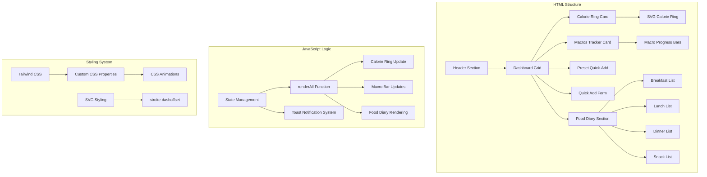
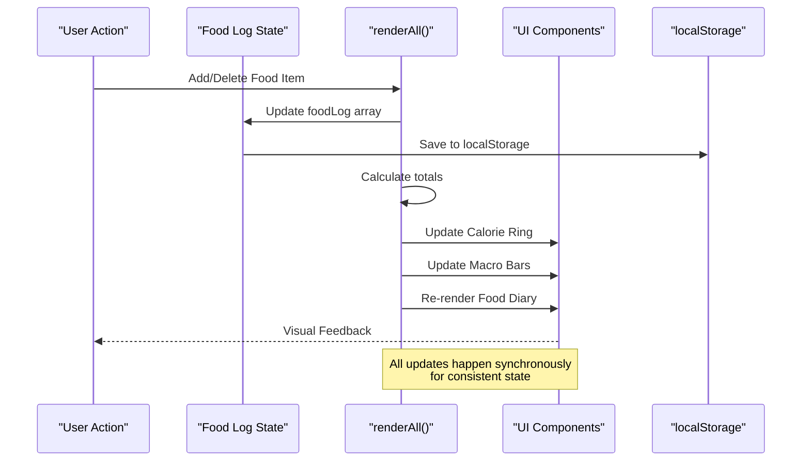
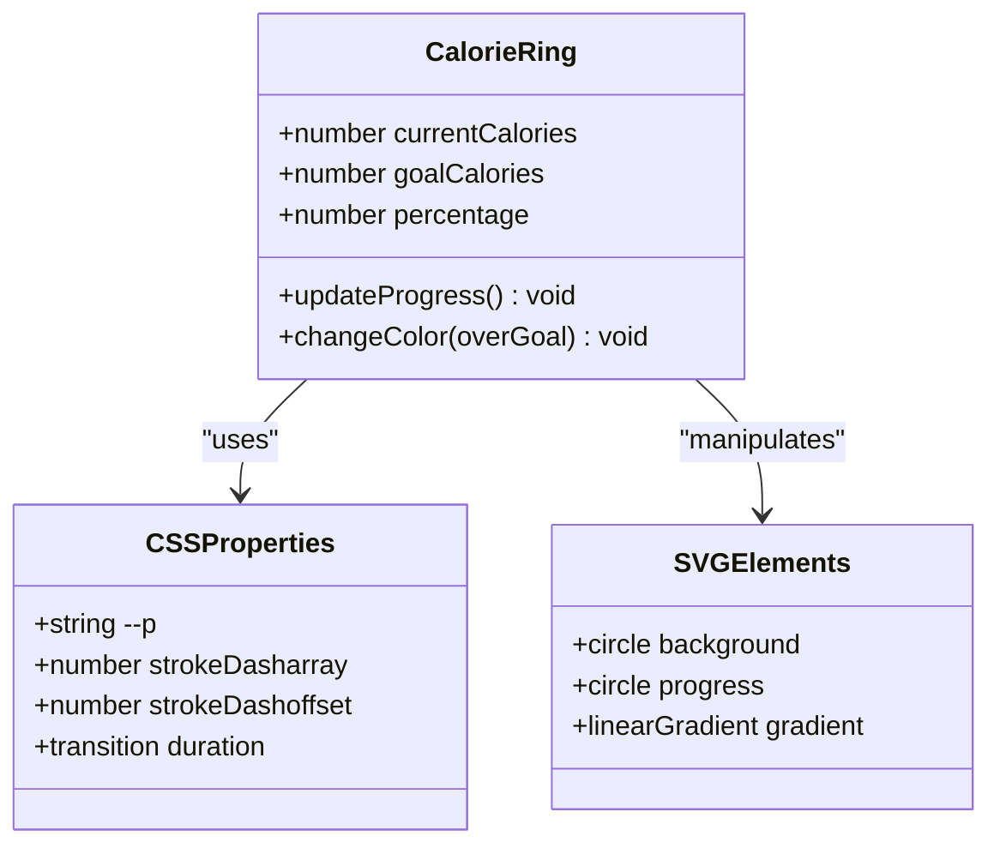
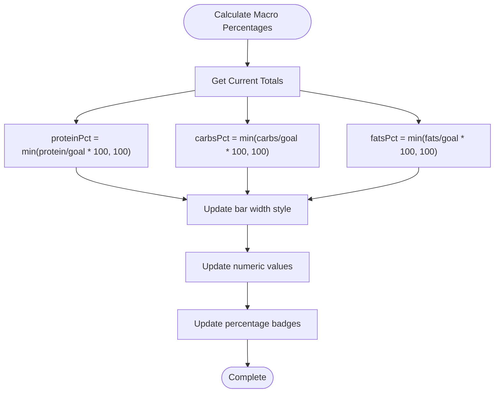
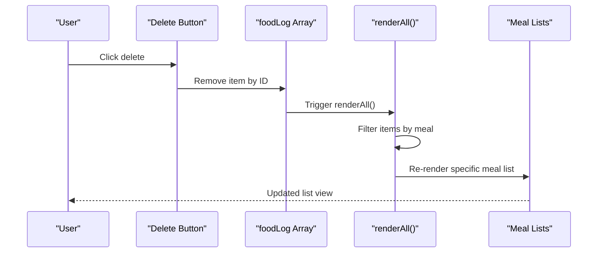
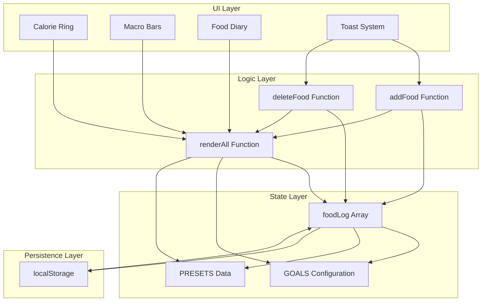

# UI Rendering System

<cite>
**Referenced Files in This Document**
- [index.html](file://index.html)
</cite>

## Table of Contents
1. [Introduction](#introduction)
2. [Project Structure](#project-structure)
3. [Core Components](#core-components)
4. [Architecture Overview](#architecture-overview)
5. [Detailed Component Analysis](#detailed-component-analysis)
6. [Dependency Analysis](#dependency-analysis)
7. [Performance Considerations](#performance-considerations)
8. [Troubleshooting Guide](#troubleshooting-guide)
9. [Conclusion](#conclusion)

## Introduction

NutriTrack is a comprehensive nutrition tracking application built as a single-page web application. The UI rendering system is centered around a sophisticated dashboard that provides real-time visualization of caloric intake, macronutrient progress, and food diary management. The system implements an elegant SVG-based calorie ring with CSS custom properties for smooth animations, dynamic macro bar calculations based on goal percentages, and a responsive meal-specific list rendering system with individual item deletion capabilities.

The architecture follows a state-driven approach where all UI updates are orchestrated through a central renderAll() function, ensuring consistency across all dashboard components. The system leverages Tailwind CSS for responsive design and includes a sophisticated toast notification system for user feedback.

## Project Structure

The NutriTrack application is implemented as a single HTML file containing all necessary functionality including HTML structure, CSS styling, and JavaScript logic. The project structure follows a monolithic approach optimized for simplicity and performance.

**Diagram sources**
- [index.html:65-275](file://index.html#L65-L275)
- [index.html:288-475](file://index.html#L288-L475)

**Section sources**
- [index.html:1-478](file://index.html#L1-L478)

## Core Components

The UI rendering system consists of several interconnected components that work together to provide a seamless user experience:

### Central Render Engine (renderAll Function)
The renderAll() function serves as the orchestrator for all dashboard updates, calculating totals from the food log and updating all visual components simultaneously. It processes caloric data, macronutrient breakdowns, and manages the food diary display.

### SVG Calorie Ring Visualization
An advanced SVG-based circular progress indicator that uses CSS custom properties (--p) and stroke-dashoffset animations to create smooth, animated transitions when caloric goals change.

### Dynamic Macro Progress Bars
Real-time progress bars that calculate widths based on goal percentages, providing immediate visual feedback for protein, carbohydrates, and fat intake against daily targets.

### Meal-Specific Food Diary
A categorized list system that organizes food entries by meal type (breakfast, lunch, dinner, snack) with individual item deletion capabilities and hover effects.

### Toast Notification System
A non-intrusive feedback mechanism that provides user confirmation for actions like adding food items, deleting entries, and resetting data.

**Section sources**
- [index.html:382-458](file://index.html#L382-L458)
- [index.html:460-471](file://index.html#L460-L471)

## Architecture Overview

The UI rendering system follows a unidirectional data flow pattern where state changes trigger re-renders of all dependent components. The architecture emphasizes performance through efficient DOM manipulation and CSS-based animations.

**Diagram sources**
- [index.html:354-380](file://index.html#L354-L380)
- [index.html:382-458](file://index.html#L382-L458)

## Detailed Component Analysis

### Calorie Ring Implementation

The calorie ring represents one of the most sophisticated visual elements in the application, combining SVG graphics with CSS custom properties for optimal performance.

#### SVG Structure and Animation
The calorie ring uses two overlapping circles: a background track and a progress circle. The progress is controlled through CSS custom properties and stroke-dashoffset calculations.

**Diagram sources**
- [index.html:22-27](file://index.html#L22-L27)
- [index.html:72-81](file://index.html#L72-L81)
- [index.html:392-403](file://index.html#L392-L403)

#### CSS Custom Property Implementation
The system uses CSS custom properties (--p) to control the progress percentage, which is then used in CSS calc() functions to calculate the stroke-dashoffset value. This approach separates presentation logic from JavaScript calculation logic.

#### Color State Management
The calorie ring automatically changes color when caloric intake exceeds the goal, providing immediate visual feedback about nutritional status.

**Section sources**
- [index.html:22-27](file://index.html#L22-L27)
- [index.html:72-81](file://index.html#L72-L81)
- [index.html:392-403](file://index.html#L392-L403)

### Macronutrient Progress Bars

The macro tracking system provides real-time visualization of protein, carbohydrate, and fat intake against daily goals using animated progress bars.

#### Width Calculation Algorithm
Each macro bar's width is calculated as a percentage of the daily goal, capped at 100% to prevent overflow. The calculation ensures smooth transitions and accurate representation of progress.

**Diagram sources**
- [index.html:413-426](file://index.html#L413-L426)

#### Performance Optimization
The macro bars use CSS transitions for smooth animations, avoiding JavaScript animation loops and leveraging hardware acceleration for better performance.

**Section sources**
- [index.html:119-148](file://index.html#L119-L148)
- [index.html:413-426](file://index.html#L413-L426)

### Food Diary Rendering System

The food diary component implements a sophisticated list rendering system that handles meal categorization, item deletion, and dynamic content updates.

#### Meal-Based Organization
Food items are organized into four categories: breakfast, lunch, dinner, and snack. Each category maintains its own list with independent total calculations and rendering logic.

#### Individual Item Management
Each food entry includes a delete button that appears on hover, providing granular control over food log entries without affecting other items.

**Diagram sources**
- [index.html:362-367](file://index.html#L362-L367)
- [index.html:428-457](file://index.html#L428-L457)

#### Empty State Handling
The system intelligently handles empty meal lists by displaying appropriate placeholder text, improving user experience during initial usage or after clearing data.

**Section sources**
- [index.html:428-457](file://index.html#L428-L457)

### Toast Notification System

The toast notification system provides non-intrusive user feedback through animated notifications that appear at the bottom of the screen.

#### Animation and Timing Control
The system uses CSS classes for show/hide states and JavaScript timers for automatic dismissal, ensuring consistent timing and smooth transitions.

#### Message Queue Management
The implementation prevents multiple overlapping toasts by clearing existing timers before showing new notifications, maintaining a clean user interface.

**Section sources**
- [index.html:460-471](file://index.html#L460-L471)

## Dependency Analysis

The UI rendering system exhibits low coupling between components while maintaining high cohesion within each functional area. Dependencies are primarily unidirectional, flowing from state management to UI updates.

**Diagram sources**
- [index.html:288-380](file://index.html#L288-L380)
- [index.html:382-458](file://index.html#L382-L458)

### Component Coupling Analysis

- **Low Coupling**: Components communicate through the central renderAll() function rather than direct dependencies
- **High Cohesion**: Related functionality is grouped within logical units (state management, rendering, persistence)
- **Unidirectional Flow**: Data flows from state → logic → UI, preventing circular dependencies

### External Dependencies

- **Tailwind CSS**: Provides utility-first styling framework for responsive design
- **Google Fonts**: Supplies Thai language font support for internationalization
- **localStorage**: Browser API for persistent data storage

**Section sources**
- [index.html:7-18](file://index.html#L7-L18)
- [index.html:20-21](file://index.html#L20-L21)
- [index.html:288-380](file://index.html#L288-L380)

## Performance Considerations

The UI rendering system implements several optimization strategies to ensure smooth user interactions and efficient resource utilization.

### DOM Manipulation Optimization

#### Batch Updates
The renderAll() function performs all calculations and DOM updates in a single pass, minimizing layout thrashing and repaint operations. This approach ensures that users see consistent state updates without intermediate visual glitches.

#### Efficient Element Selection
The system uses targeted element selection with specific IDs and class names, reducing the overhead of broad DOM queries.

#### CSS-Based Animations
Animations leverage CSS transitions and transforms rather than JavaScript animation loops, taking advantage of browser optimizations and GPU acceleration.

### Memory Management

#### Event Listener Cleanup
The form submission handler is attached once during initialization, preventing memory leaks from duplicate event listeners.

#### LocalStorage Efficiency
Data persistence uses JSON serialization with minimal overhead, storing only essential food log information.

### Animation Performance

#### Hardware Acceleration
CSS transforms and opacity changes utilize hardware acceleration for smooth 60fps animations.

#### Transition Optimization
Animation durations are kept short (0.2-0.6 seconds) to maintain responsiveness while providing adequate visual feedback.

### Responsive Design Performance

#### Tailwind CSS Optimization
The use of utility classes reduces CSS bundle size and eliminates the need for complex media query logic in JavaScript.

#### Mobile-First Approach
The responsive grid system adapts seamlessly across device sizes without requiring separate mobile-specific code paths.

## Troubleshooting Guide

### Common Issues and Solutions

#### Calorie Ring Not Updating
If the calorie ring fails to update, verify that the CSS custom property --p is being set correctly and that the SVG circle has the proper class assignment. Check browser console for any JavaScript errors related to element selection.

#### Macro Bars Display Incorrect Values
Ensure that the GOALS configuration matches the expected input ranges. Verify that food item inputs are properly parsed as numbers and that the percentage calculations account for edge cases like zero values.

#### Food Items Not Appearing in Diary
Check that the meal category values match the expected keys (breakfast, lunch, dinner, snack). Verify that localStorage is accessible and not blocked by browser settings.

#### Toast Notifications Not Showing
Confirm that the toast element exists in the DOM and that CSS classes are being applied correctly. Check for any CSS conflicts that might override the toast styling.

### Debugging Techniques

#### State Inspection
Use browser developer tools to inspect the foodLog array and verify that data is being stored and retrieved correctly from localStorage.

#### Performance Profiling
Utilize browser performance monitoring tools to identify bottlenecks in the renderAll() function or excessive DOM manipulations.

#### Network Monitoring
Check localStorage access patterns and verify that data persistence is working as expected across browser sessions.

**Section sources**
- [index.html:382-458](file://index.html#L382-L458)
- [index.html:460-471](file://index.html#L460-L471)

## Conclusion

The NutriTrack UI rendering system demonstrates a well-architected approach to building interactive web applications with sophisticated visualizations. The central renderAll() function effectively orchestrates all dashboard updates while maintaining clean separation of concerns between state management, business logic, and presentation layers.

Key strengths of the implementation include:

- **Efficient State Management**: Single source of truth for food log data with automatic persistence
- **Smooth Animations**: CSS-based animations provide excellent user experience without JavaScript overhead
- **Responsive Design**: Tailwind CSS integration ensures consistent appearance across devices
- **Performance Optimization**: Batched DOM updates and hardware-accelerated animations
- **User Feedback**: Comprehensive toast notification system for action confirmation

The system successfully balances complexity with maintainability, making it suitable for both educational purposes and production deployment. The modular architecture allows for easy extension with additional features while preserving the core rendering pipeline's integrity.